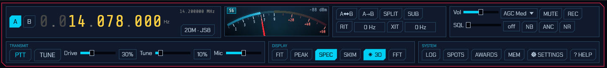
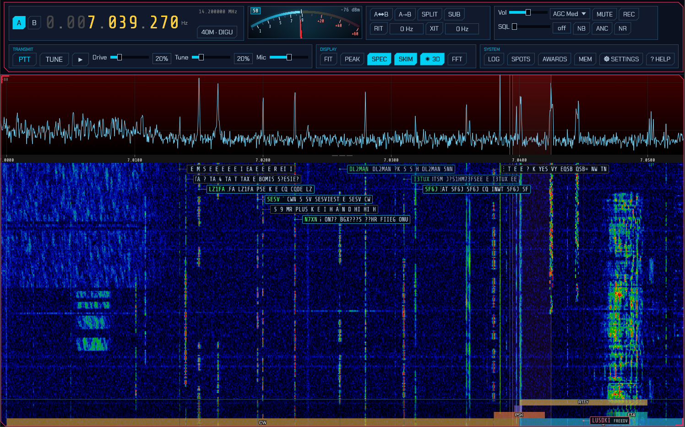
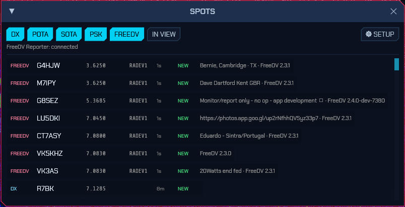

# SDRoxide User Manual

SDRoxide is a PowerSDR/Thetis-style software-defined-radio transceiver. It gives
you a panadapter and waterfall, dual VFOs, a full set of receive and transmit
controls, FT8/FT4 digital modes with an integrated logbook, a wideband CW
skimmer, and the ability to drive either a SoapySDR device or a CAT-controlled
radio (such as a Xiegu, Icom, or Yaesu) with audio over a USB sound card. The
same interface runs as a native desktop application, streams to a web browser,
or connects to a remote sdroxide server.

---

## Table of contents

1. [Feature overview](#1-feature-overview)
2. [Basic operation](#2-basic-operation)
3. [Digital modes (FT8, FT4, PSK31, RTTY, Olivia, THOR, FSQ, SSTV, RF Paint)](#3-digital-modes)
4. [Skimmers (CW, PSK, RTTY)](#4-skimmers)
5. [Settings](#5-settings)
6. [Solar system 3D view](#6-solar-system-3d-view)
7. [Remote operation](#7-remote-operation)
8. [Web operation](#8-web-operation)
9. [Spotting, awards, and QSL upload](#9-spotting-awards-and-qsl-upload)
10. [Command-line reference](#10-command-line-reference)
11. [Configuration files](#11-configuration-files)
12. [Troubleshooting](#12-troubleshooting)
13. [Appendix: keyboard shortcuts, modes, bands](#13-appendix)

---

## 1. Feature overview


- **Panadapter and waterfall** with click/drag tuning, scroll-to-zoom, a
  draggable filter passband, a colour-coded band-plan strip, and eight
  selectable waterfall colour schemes (including an Icom-style palette).
- **Dual VFO (A/B)** with split operation, VFO swap/copy, and a sub-receiver on
  the inactive VFO.
- **All the common modes:** LSB, USB, CW, AM, SAM, NFM, WFM, DIGU, DIGL, DSB, a
  spectrum-only mode (SPEC), the automatic digital modes **FT8** and **FT4**, the
  keyboard modes **PSK31**, **RTTY**, **Olivia**, **THOR** and **FSQ**, image
  **SSTV**, and the transmit-only **RF Paint** (spectrum-painting) mode.
- **Receive controls:** AGC (Off/Slow/Med/Fast), volume, mute, squelch, an
  impulse noise blanker, an adaptive auto-notch (constant-tone canceller),
  noise reduction (neural RNNoise or spectral, three levels each), RIT, and a
  draggable filter passband.
- **Transmit** (on TX-capable rigs): PTT, TUNE, drive and tune-drive levels,
  mic gain, XIT, and a transmit meter (power / SWR / ALC). A ham-band-only
  transmit lockout is on by default. While transmitting, the panadapter shows a
  **monitor of your own signal**: wideband IQ rigs display it at its on-air
  frequency in the full span; CAT rigs and digital modes show a narrow
  transmit-sideband scope (an approximation built from the outgoing audio).
- **Voice keyer** — ten recorded messages, transmitted from a button, a numpad
  key, a MIDI pad or a Hamlib `send_voice_mem` command; works in the voice modes
  and in RADE digital voice.
- **FT8 / FT4** with a live decode list, automatic QSO sequencing, a world map,
  a transcript, and automatic logging.
- **Integrated logbook** for digital and manual QSOs, with contest and QSL
  fields, a worked-before check, ADIF import/export and text export.
- **Live spotting** — a DX cluster (telnet) plus POTA, SOTA, PSK Reporter and
  FreeDV Reporter feeds shown as clickable markers on the panadapter and world
  map; click to tune and pre-fill a log entry.
- **FreeDV Reporter** — report your station to
  [qso.freedv.org](https://qso.freedv.org/) and see who else is on FreeDV,
  including callsign exchange in the RADE End-of-Over frame.
- **Callsign lookup and QSL upload** — QRZ/HamQTH name/QTH/grid auto-fill, and
  one-click (or automatic) upload to eQSL, QRZ Logbook and Club Log, with LoTW
  ADIF export and confirmation download.
- **Award tracking** — live DXCC / WAS / WAZ / grid tallies, worked vs confirmed.
- **Wideband skimmers** — a CW skimmer plus PSK31 and RTTY skimmers that decode
  many signals at once and label them on the waterfall.
- **Four radio backends:** SoapySDR devices, OpenHPSDR (Hermes/Metis) Ethernet
  SDRs, a TCI server (ExpertSDR3/Thetis), or a CAT-controlled radio with audio
  over a USB sound card (demodulated audio or stereo IQ).
- **Memory channels** and per-band memory of your last frequency/mode/filter.
- **Solar system 3D view** — the Sun, the Earth and the Moon, the
  other seven planets and eighteen of their moons with their orbits, live NASA
  SDO solar imagery, sunspot regions and CME trajectory cones,
  an arrival estimate when one is headed our way, the live auroral oval standing
  over the globe with a Kp forecast for tonight, live amateur-satellite orbits
  with click-through pass predictions, your FT8 contacts arcing between stations,
  and a propagation panel with MUF, Kp/A, F10.7 and the current GOES X-ray level.
- **Remote and web operation:** run headless as a server and control it from a
  browser or from a second sdroxide instance over the network.

---

## 2. Basic operation

### 2.1 Launching

Start the native application with no arguments to use your configured radio:

```
sdroxide
```

To try the interface with no hardware, use the built-in signal generator:

```
sdroxide --siggen
```

See the [command-line reference](#10-command-line-reference) for all options.

### 2.2 The main window

The window has two parts: a **top control bar** of captioned modules that reflow
onto more rows as the window narrows, and the **panadapter** (spectrum plus
waterfall) filling the rest of the window. In FT8/FT4 the lower part of the
window is shared with the digital operating panel.



The control-bar modules, left to right, are: Frequency, S-meter, Band/Mode,
VFO, RIT/XIT, Receiver, Filter/Noise, Transmit (TX-capable rigs only), Display,
FFT, and System.

### 2.3 Tuning

**The frequency readout** is a ten-digit display. Hover over any digit and:

- **Scroll the mouse wheel** to tune that decade up or down.
- **Click the upper half** of a digit to increment it, the **lower half** to
  decrement it.

The smaller grey number below the readout is the *inactive* VFO's frequency.

**On the panadapter:**

- **Scroll the wheel** to zoom in and out around the cursor.
- Press **F** to reset the view to the full receiver span.
- **Left-click** tunes the active VFO to the clicked frequency. **Shift+click**
  tunes VFO B instead.
- **Left-drag** grabs the spectrum and slides it (the tuning moves with the
  content).
- **Right-drag** pans the view only, without changing tuning.
- **Shift+drag** measures bandwidth: a horizontal ruler with dotted vertical
  markers appears between where you pressed and the current pointer, showing the
  **start and end frequencies** at the markers and the **frequency span** (e.g. a
  signal's width) below. It works on both the spectrum and the waterfall. When you
  release the button the measurement lingers and fades out over about five
  seconds, so you can read it after letting go.


**Keyboard tuning** (ignored while typing in a text field):

- **Left / Right arrow:** ±100 Hz (with **Shift**, ±10 Hz).
- **Up / Down arrow:** ±1 kHz.
- **Page Up / Page Down:** ±10 kHz.


**Band-plan strip.** A colour-coded strip along the bottom of the waterfall
labels the allocations. Zoomed out it shows coarse bands (ham, broadcast, CB,
AM); zoomed into a ham band it splits into the CW / digital / SSB / beacon
sub-segments. When you zoom in close (a span of ~100 kHz or less), the digital
sub-band is broken out into the individual popular modes — **FT8, FT4, JS8,
WSPR, QRSS, PSK, RTTY, SSTV, FREEDV** — each in its own colour.

### 2.4 Bands and modes

Click the **Band / Mode** chip (which reads, for example, `20M · USB`) to open a
popup with three rows:

- **BAND:** `160M 80M 60M 40M 30M 20M 17M 15M 12M 10M 6M 2M GEN`. Each band
  remembers your last frequency, mode, and filter.
- **MODE:** `LSB USB CW AM SAM NFM WFM DIGU DIGL DSB SPEC`.
- **DIGITAL:** `FT8 FT4 PSK RTTY OLIVIA THOR FSQ SSTV RFPAINT RADE` (see
  [Digital modes](#3-digital-modes)).


See the [appendix](#13-appendix) for what each mode is.

### 2.5 VFOs, split, and the sub-receiver

The **VFO** module has:

- **A / B** select chips in the Frequency module (the active VFO is highlighted).
- **Swap VFOs** — exchange A and B.
- **Copy A to B** — copy the active VFO to the other.
- **SPLIT** — transmit on one VFO and receive on the other.
- **SUB** — enable a second receiver on the inactive VFO (routed to the right
  ear). The inactive VFO's marker on the panadapter brightens when SUB is on.

### 2.6 RIT and XIT

The **RIT / XIT** module offsets receive (RIT) and, on TX-capable rigs, transmit
(XIT) without moving the dial. Toggle **RIT** (or **XIT**) on, then set the
offset in the adjacent field (±9999 Hz in 5 Hz steps).

When either is enabled, the offset is drawn on the panadapter: RIT shows a dashed
grey **dial reference** line (the receive marker and passband already sit at
dial + RIT) with a blue labelled bracket back to the dial, and XIT shows a green
**TX marker** line with a green labelled bracket from the transmit base to
dial + XIT — so you can see at a glance how far RX and TX are shifted.


### 2.7 Receiver controls

- **AGC** — a drop-down: `Off`, `Slow`, `Med`, `Fast`.
- **Vol** — audio volume.
- **MUTE** — mute the receiver (keyboard shortcut **M**).
- **SQL** (Filter/Noise module) — squelch; below the open threshold it reads
  `off`.
- **NB** — impulse noise blanker on the raw signal (keyboard shortcut **N**).
- **ANC** — automatic notch: an adaptive filter that cancels **constant tone
  elements** — heterodynes, carriers, and tuner-uppers — while leaving voice and
  noise. Toggle it on when a steady whistle is spoiling a voice signal. (Like NR,
  it affects only what you hear, not the digital decoders; leave it off for CW
  and data modes, whose signals *are* tones.)
- **NR** — noise reduction on the audio, with two selectable engines. Click it
  to cycle **Off → AI Low → AI Med → AI High → NR Low → NR Mid → NR High → Off**:
  - **AI Low/Med/High** — a neural **RNNoise** denoiser. Trained on speech, it
    recognises the *voice* and mutes everything else, so it clears non-stationary
    junk that spectral NR can't — babble, wind, keyboard/shack noise, fluttering
    hiss — with little of the underwater warble. The three levels are a
    wet/dry depth: AI High is the full effect, AI Low a lighter touch.
  - **NR Low/Mid/High** — the classic **spectral** noise reduction: it suppresses
    the stationary noise floor while letting the changing, speech-like parts
    through. Fast and predictable on steady static and hiss.

  Both make voice quieter to listen to and easier to copy with less fatigue.
  Higher settings remove more noise but can add faint artefacts on weak signals,
  so pick the lowest level that cleans the audio; on a noisy voice signal, start
  with **AI Med**. (NR affects only what you hear; the FT8/FT4/PSK/RTTY decoders
  still receive the untouched signal, and a steady unmodulated carrier — a
  heterodyne — is treated as noise and suppressed.)

**The receive filter** is set by dragging the passband edges directly on the
panadapter: two vertical grip lines mark the filter's low and high edges (they
brighten to orange when you can grab them). Drag an edge to widen or narrow the
passband. The grips work on both the spectrum and the waterfall.

### 2.8 The display and FFT controls

**Display module:**

- **FIT** — auto-set the waterfall floor and ceiling for the best contrast.
- **PEAK** — show a decaying peak-hold trace over the spectrum.
- **SPEC** — show or hide the spectrum line above the waterfall (lit when the
  spectrum is shown).
- **SKIM** — opens the skimmer popup (per-skimmer on/off and squelch); lit while
  any skimmer runs. See [Skimmers](#4-skimmers).
- **☀ 3D** — open the [solar system 3D view](#6-solar-system-3d-view): a second
  window in the native app, a second browser tab in the web client.

**FFT module:**

- **floor** / **ceil** — the waterfall's dB range.
- **FFT** size — `2048`, `4096`, `8192`, `16384`, or `32768`.

The **waterfall colour scheme** and the **spectrum background gradient** are set
on the **UI** tab of the Settings window (see
[§5.3](#53-ui-display-preferences)). The colour scheme is one of
`Classic`, `Viridis`, `Gray`, `Icom`, `Neon`, `Synthwave`, `Matrix`, or `Tron`;
the gradient fills the spectrum area from a top colour down to a bottom colour
(default dark red → black) and can be turned off.

You can also resize the split between the spectrum line and the waterfall by
dragging the frequency-scale strip between them.


### 2.9 The S-meter

The **S-meter** reads S0 (−127 dBm) through S9 (−73 dBm) and beyond, with the
bar turning red past S9. It shows the S-unit (for example `S9+20`) and the level
in dBm. On transmit it is replaced by a transmit meter showing power, SWR, and
ALC as the rig reports them.

### 2.10 Transmit

On a TX-capable rig the **Transmit** module appears:

- **PTT** — key the transmitter.
- **TUNE** — send a carrier at the tune-drive level for tuning an ATU.
- **Drive** — transmit drive (0–100%).
- **Tune** — the (lower) drive level used by TUNE.
- **Mic** — microphone gain.

> **Transmit safety:** by default sdroxide refuses to transmit outside the
> amateur bands (`tx_ham_only`). Transmit hardware gains start at minimum and
> the tune drive defaults low. Raise drive deliberately.

On a rig with its own power control (TCI), Drive and Tune command the rig's
output power directly — and both sliders adopt the rig's current settings when
sdroxide connects, so a level you set in ExpertSDR3 carries over instead of
being overwritten.

### 2.11 Voice keyer

The **▶** button in the Transmit module opens the **voice keyer**: ten recorded
messages you can put on the air with one press — a CQ call, your callsign, a
contest exchange, a 73.

Each row is one slot:

- Type a **name** for the slot (optional; it is just a label).
- **REC** records from your microphone. Press it again to stop and store the
  message; recordings stop by themselves after two minutes.
- **PLAY** plays the message back through your speakers so you can check it.
  Nothing is transmitted, and it replaces the receive audio while it runs.
- **TX** keys the transmitter, sends the message and unkeys at the end.
  **STOP** ends it early — so does pressing PTT, TUNE, or Abort transmit.
- **✕** erases the recording.

Recordings are stored as plain 48 kHz mono WAV files in
`~/.config/sdroxide/voice` (see [11. Configuration files](#11-configuration-files)),
one per slot, so you can also record a message in an audio editor, name it
`slot3.wav`, and drop it in.

**Triggering a message.** Out of the box the digits **1**–**9** and **0** play
slots 1–10 and **−** stops one; on a full keyboard those are the numpad keys
(the platform reports numpad and top-row digits identically, so either works).
Like every other binding these can be changed — or moved onto a MIDI pad or
footswitch — on the **Controls** tab; see
[5.4](#54-controls-keyboard-mouse-and-midi). A key over an **empty** slot does
nothing at all, which is why the digits can ship bound when PTT deliberately
does not.

External programs can trigger the keyer too: with the built-in Hamlib server
running ([5.8](#58-servers-letting-other-programs-drive-the-radio)),
`\send_voice_mem <1–10>` plays a slot and `\stop_voice_mem` stops it.

> **Where it works.** The keyer is available in every voice mode and in
> **RADE** digital voice, where the message is fed to the codec exactly as a
> live over would be. The other digital modes generate their own transmit
> audio, so the button is hidden there (and the window closes if you switch
> into one). Recording is refused while you are transmitting — it is the same
> microphone.

### 2.12 Memory channels

Open **MEM** (System module) for the memory channels window. Type a name and
press **Store** to save the current frequency and mode. Each saved row has a
**RCL** (recall) button and a **DEL** (delete) button.


---

## 3. Digital modes

sdroxide has several families of digital mode. **FT8** and **FT4** are automatic,
timeslot-based modes with QSO sequencing, a world map, and automatic logging
(3.1–3.6). **PSK31**, **RTTY**, **Olivia**, **THOR** and **FSQ** are live keyboard
modes: you tune onto a signal, read the decoded text, and type a reply that
transmits as you go (3.7–3.8). **SSTV** is an image mode: received pictures build
up in a gallery and you transmit composed images (3.9). **RF Paint** is a
transmit-only mode that draws text and pictures directly onto the far station's 
waterfall (3.10).

### 3.1 Entering the mode

Open the Band/Mode popup and choose **FT8** or **FT4** from the DIGITAL row. The
panadapter locks to the digital sub-band (the audio range just above the dial),
and the FT8/FT4 operating panel appears in the lower part of the window. A
draggable divider sets how much height the panel gets.


While in a digital mode a **FT8 FREQUENCIES** (or **FT4 FREQUENCIES**) row of
band chips appears in the Band/Mode popup. Click one to jump the dial to the
standard calling frequency for that band; a chip highlights when the dial is
already on it.

### 3.2 One-time setup: your callsign and grid

Click **SETUP** in the QSO area to open the **FT8 / FT4 Setup** window:

- **My callsign** — your call (entered in upper case).
- **My grid** — your Maidenhead grid locator (for example `FN42`).
- **TX period** — whether you call in the **Even** or **Odd** time slots.
- **Auto-sequence** — advance the QSO automatically (recommended on).
- **TX watchdog / Give up after** — how long unattended transmitting may
  continue with no progress, and how many unanswered calls to one station are
  worth making. Both 0 to disable.
- **Message templates** — the CQ / Grid / Report / R+Report / RR73 / 73 lines,
  using the placeholders `{MYCALL}`, `{MYGRID}`, `{DX}`, and `{REPORT}`. The
  defaults follow standard FT8 practice; you rarely need to change them.


These settings are saved to `digi.json` (see [configuration files](#11-configuration-files)).

### 3.3 The operating panel

The panel has two halves:

- **DECODES** (left) — a live list of decoded stations. Each row shows the SNR
  (colour-coded by strength), the audio frequency, the callsign, the grid, and
  the full message, with a **REPLY** button on the right. CQ calls are
  highlighted. Decoded stations are also marked as boxes on the waterfall.
  A **CQ DX** call only counts as a CQ for you when you actually are DX for the
  caller — a different DXCC entity, or (when the prefix can't be resolved)
  3000 km or more away. Otherwise the row stays plain and the **CQ only** filter
  skips it, so the list isn't full of DX calls you shouldn't answer. You can
  still **REPLY** to such a station if you want to.
  A badge after the callsign says what the station would be worth against your
  log: **DXCC** (an entity you have never worked), **BAND** (worked before, but
  not on this band), **GRID** (a new grid square), **NEW** (a callsign you have
  never worked) or **DUPE** (already in the log for this band — the row fades
  back). The **New only** filter keeps just the rows that would put something new
  in the log.
- **QSO** (right) — a world map (your location, the station you are working, and
  a transmit indicator), a station card showing the current step
  (`Idle`, `Wait CQ`, `Calling CQ`, `Tx Grid`, `Tx Report`, `Tx R+Report`,
  `Tx RR73`, `Tx 73`, `Confirming`, `Done`), and a transcript of the exchange
  (outgoing lines in gold, incoming in green, plus the queued next message).

Beyond the everyday exchange, the decode list understands the other FT8 message
layouts: **compound and non-standard callsigns** (`DL/W1AW`, `W1AW/P`), **hashed
callsigns** (shown as `<W1AW>` once that station has been heard, and as `<...>`
until then), **free text** (13 characters, listed as `TEXT` since it names no
sender), **contest exchanges** (ARRL RTTY Roundup, Field Day) and **DXpedition**
messages. Transmitting works the same way round: a message that the standard
layout can't carry is sent in the layout that can, and the transcript records
what actually went on the air — addressing a compound call sends your own
callsign hashed (`DL/W1AW <AB1CD> RR73`), which drops the signal report, and
free text is cut to 13 characters.

### 3.4 Working stations

- **Answer a call:** click **REPLY** on a decode. sdroxide adopts that station,
  picks the opposite time slot, and runs the exchange automatically.
- **Losing a pile-up:** if the station you called comes back to someone else
  instead, sdroxide stops calling and holds at `Wait CQ` rather than doubling
  into their QSO. The transcript shows a pink line — *"W9XYZ is working K1ABC"* —
  so it's clear they aren't talking to you, and calling resumes automatically
  when they call CQ again (or come back to you). The hold gives up after five
  minutes. A 73 / RR73 you already owe still goes out, so a finished contact is
  never dropped unlogged.
- **Call CQ:** click **CALL CQ**. When several stations come back in the same
  slot, sdroxide picks which to work first rather than taking whichever decoded
  first: a station already worked this session goes last, among signals of
  similar strength a new DXCC entity wins, and otherwise the strongest does —
  it is the one most likely to complete. The others are listed in the transcript
  ("also calling: …") so you can work them next.
- **Set your transmit tone:** click a decode row (or click a station box on the
  waterfall) to set your transmit audio frequency to that station's frequency.
  The audio frequency is clamped to 200–3500 Hz.
- **Pick the message yourself:** the row under the transcript holds the five
  exchange messages — **GRID**, **RPT**, **R+RPT**, **RR73**, **73**. Clicking
  one jumps the exchange to that message and the sequencer carries on from
  there, the way WSJT-X's Tx1–Tx6 buttons do. The current step is highlighted,
  and the buttons are inactive until you are working someone.
- **Send free text:** type into the field beside those buttons and press
  **SEND** (or Enter). It goes out verbatim in the next transmit slot and then
  the exchange picks up exactly where it left off — a queued line never
  completes or logs a contact in place of your 73. FT8 carries 13 characters of
  free text, so that is what the field accepts.
- **Stop:** **STOP QSO** ends the current QSO gracefully; **STOP TX** aborts the
  current transmission immediately and un-keys.
- **Unattended transmitting stops itself.** Two limits, both on the FT8 setup
  window: the **TX watchdog** (6 minutes by default) stops the sequencer when
  nothing has come back and you haven't touched anything, and **Give up after**
  (10 calls) abandons a station that never answers. `WATCHDOG` appears on the
  station card when the first one fires; calling CQ or picking a message clears
  it and starts the clock again. Repeating a CQ doesn't count as an unanswered
  call — that is what the watchdog is for. Set either to 0 to disable it.

Transmission happens automatically in your chosen time slot (FT8 slots are 15 s,
FT4 slots are 7.5 s) and goes through the normal transmit path, so the ham-band
lockout and transmit safety still apply.

### 3.5 Reporting what you hear

Enable **Upload my FT8/FT4 decodes** on the Network settings tab to report every
station you decode to [pskreporter.info](https://pskreporter.info), where your
station then shows up as a receiver and your reports feed everyone else's
propagation maps. Reports are batched and uploaded every five minutes (the
interval the collector asks for), keeping the strongest report per station per
band. The callsign and grid come from the General tab — both are required, since
a report with no location can't be placed on the map. The optional **Antenna**
line is shown on your station's page. The **Collector** host and port are there
for testing: port 14739 is the project's test collector, which accepts reports
without publishing them.

### 3.6 Logging and the logbook

Completed FT8/FT4 QSOs are logged automatically. Open the full logbook with the
**LOG** button (System module).


The logbook lists QSOs grouped by day (newest first) and covers both digital and
manual entries. You can:

- **+ NEW ENTRY** — add a manual QSO. Besides the basics (Call, Grid, Freq MHz,
  Mode, RST sent/received, Date/Time UTC with a **NOW** button, comment) the form
  carries **Name, QTH, State, Country**, transmit **Pwr**, and **Contest** fields
  (contest id and sent/received serial numbers). If you've already worked that
  call on the band, a **⚠ WORKED BEFORE** badge appears. Press **LOOKUP** to
  fill name/QTH/grid from your callsign-lookup provider (see
  [§9.2](#92-callsign-lookup)).
- **EDIT** / **DEL** — edit or delete an entry. Editing preserves fields the form
  doesn't show (resolved DXCC/zones, QSL status).
- **IMPORT** — load QSOs from an ADIF (`.adi`) file. Imported records are
  de-duplicated against the log (same call + band within two minutes are skipped).
- **ADIF** — export the whole log to `sdroxide-log.adi` (also the file you sign
  with TQSL for LoTW).
- **TXT** — export the whole log to `sdroxide-log.txt`.

A small status column on each row shows QSL state: a green **✓** once a QSO is
confirmed (LoTW, eQSL or card), a dim **↑** once it has been uploaded but not yet
confirmed. Hover it for the per-service detail.

Records also hold the fields used by lookup, upload and awards — DXCC entity,
CQ/ITU zones, IOTA and POTA/SOTA references, and per-service QSL status. See
[§9. Spotting, awards, and QSL upload](#9-spotting-awards-and-qsl-upload) for the
one-click upload buttons and award tracking.

The log is stored in `qso_log.json`.

### 3.7 PSK31 and RTTY

Choose **PSK** or **RTTY** from the DIGITAL row of the Band/Mode popup. As with
FT8/FT4 the panadapter switches to a zoomed sub-band waterfall, but the lower
panel is a live **messaging area** instead of a QSO sequencer.


**Receiving:**

- Decoded text streams into the receive window as signals are copied.
- Tune exactly onto a signal with the **−/+** buttons (±10 Hz) — or click its
  skimmer label (see [Skimmers](#4-skimmers)). In RTTY, two amber
  lines on the waterfall mark the expected mark/space tones to tune between.
- The **SQL** slider in the panel header is a decode squelch: raise it until the
  window stops filling with garbage when no signal is present, lower it (to the
  left) to copy weaker signals. It applies to every keyboard mode
  (PSK/RTTY/Olivia/THOR/FSQ).

**Transmitting (type-ahead):**

- Type your reply in the transmit box and press **TX** to key up. Text is sent as
  you type; characters that have already gone out turn **green**, so you can
  watch the transmission catch up when you pause.
- **CALL CQ** loads a CQ macro and starts sending it; **CLEAR** empties the
  buffer and stops; pressing **TX** again unkeys.

**Settings (PSK/RTTY setup dialog):**

- **PSK** is BPSK31 — differential BPSK with the standard varicode alphabet.
- **RTTY** defaults to 45.45 baud, 170 Hz shift, Baudot (ITA2). **Shift**
  (170 / 425 / 850 Hz) and **Baud** (45 / 50 / 75) are selectable.
- Your callsign and grid (shared with the FT8/FT4 setup) fill the CQ macro.

**Skimmers:** the PSK and RTTY skimmers (see [Skimmers](#4-skimmers)) label
signals across each band's PSK/RTTY calling sub-bands. Clicking a label from any
mode switches to PSK or RTTY, tunes onto the signal, and opens this panel.

### 3.8 Olivia, THOR and FSQ

Three more keyboard modes are on the DIGITAL row. **Olivia** and **THOR** reuse
the same messaging panel as PSK/RTTY; each mode's submode is chosen on its setup
page (**⚙ SETUP**):

- **Olivia** — a slow, extremely robust MFSK mode with Walsh/Hadamard block
  coding. Choose the **tone count** (2, 4, 8, 16, 32, 64) and **bandwidth**
  (125–2000 Hz). The symbol rate is bandwidth ÷ tones; **32/1000** and **16/500**
  are the common combinations. Both stations must use the same tones/bandwidth.
- **THOR** — a DominoEX-family 18-tone mode using incremental frequency keying
  (IFK+) with convolutional forward error correction. Choose a submode
  (**THOR4 … THOR32**); THOR16 is the usual default. The tone bank edges are drawn
  on the waterfall.

**FSQ** (Fast Simple QSO) has its own panel for the directed **FSQCALL** layer.
It is a 33-tone incremental-FSK mode; choose the **speed** (FSQ-2/3/4.5/6) and an
**FSQ call** on the setup page (defaults to your callsign):

- **Heard list** (left) — every station whose transmission is decoded is listed,
  most-recent first. Click a callsign to make it the directed target.
- **Compose** (right) — the **To:** line shows the current target (or ALLCALL).
  Type a message and press **SEND** (or Enter); sdroxide prefixes your call and
  transmits one burst (`YOURCALL:TARGET message`). **? heard** asks the selected
  station to send its heard list; incoming `?` queries addressed to you are
  answered automatically. **CALL CQ** sends a broadcast CQ.
- **Contacts** — the **CONTACTS** button opens an address book (persisted in
  `contacts.json`). Add callsigns, give them names, click **TO** to target one, or
  **DEL** to remove.
- **Images** — **Send image…** picks a picture, which is scaled to grayscale and
  transmitted as an analog tone scan; received pictures appear in the image
  gallery below.

These three modems are native-Rust and self-contained. On-air interoperability
with fldigi is being validated; the first release targets clean-to-moderate
signals.

### 3.9 SSTV

Choose **SSTV** from the DIGITAL row to send and receive pictures. The panel has
a received-image gallery on the left and a transmit compositor on the right, with
a row of mode buttons across the top: **Auto**, **Scottie 1**, **Scottie 2**,
**Scottie DX**, **Martin 1**, **Martin 2**, **Robot 72**, and **Robot 36**.


**Auto** (the default) auto-detects the mode on receive — from the VIS header, or,
if you tune in mid-picture, from the sync cadence — and transmits in **Martin 1**
until a mode has been detected. Selecting a specific mode instead pins both the
receive decoder and the transmit compositor to that mode.

Band buttons tune to that band's common SSTV calling frequency (for example
14.230 MHz on 20 m, 7.171 on 40 m, 3.730 on 80 m), staying in SSTV.

**Receiving:**

- Incoming pictures decode scanline-by-scanline and appear in the **LIVE** view
  as they arrive, then land in the **RECEIVED** gallery (newest first).
- The **Signal** meter shows the receive audio level so you can confirm audio is
  reaching the decoder and set your input gain.
- In **Auto**, the mode is identified from the VIS header (or the sync cadence if
  you tuned in mid-picture) and pre-selected for your next transmission — no need
  to pick it.
- Received images are saved as PNG under `~/.config/sdroxide/sstv_rx/` and reload
  into the gallery next time.

**Transmitting:**

- The **TRANSMIT** side has five image slots that work like **tabs**. **Click** a
  slot to make it the active tab (highlighted with a cyan border and its number);
  the message box below then edits *that slot's* message. Use the **Load image…**
  button (or **double-click** a slot) to pick an image file, which is
  automatically cropped and scaled to the current mode's dimensions and stored
  under `~/.config/sdroxide/sstv_tx/`.
- Type a **message** for the active slot. Each slot keeps its own message —
  switching slots swaps the text — and the messages are saved to
  `~/.config/sdroxide/sstv_messages.json`, so they persist across restarts. The
  lines are drawn over the image in bold with a black outline for readability;
  the **first line is rendered at double size** as a title. A **live preview**
  shows exactly what will be transmitted,
  including a small red→black header strip with your **callsign** on the left and
  "SDRoxide" + version on the right. (Set your callsign on the **General**
  settings tab, or the FT8 setup dialog.)
- Press **TX** to transmit the composed image; **ABORT TX** stops a transmission
  in progress.
- **TX slant** trims the transmit clock (in ppm) to remove slant seen on a
  receiver whose sound-card clock differs slightly from yours — nudge it until a
  test picture decodes straight on the far end; **0** resets it. It applies to
  the next transmission and is persisted. (Received pictures are auto-deslanted
  by sdroxide, so this is only for the transmit direction.)

> **Note:** SSTV decode/encode runs in the server engine, so the panel works the
> same in the native app and the browser client. RX quality depends on signal
> conditions — clean signals decode well; weak or drifting signals may slant or
> show noise (ongoing refinement).

### 3.10 RF Paint (spectrum painting)

Choose **RFPAINT** from the DIGITAL row for **RF Paint** — a transmit-only mode
that draws text and pictures **directly onto a receiver's waterfall**. There is no
decoder and no message format: the picture *is* the signal. Anyone watching their
panadapter on your frequency simply *sees* what you paint, so it is a fun way to
put a callsign, a grid, or a small graphic on the band.


RF Paint transmits on **USB** and fills a 3 kHz audio band (about 300–3300 Hz),
so it sits inside a normal SSB channel. It has no calling frequency — use it on a
clear frequency where you are allowed to transmit, and tell the other station
where to look. The panel has two side-by-side areas:

- **TEXT PAINT** — type a line of text and it is rendered as upright letters that
  scroll up the far station's waterfall. The font size is fixed, so a longer
  message simply makes a wider banner (a longer transmission) rather than smaller
  letters. A live **preview waterfall** shows exactly how the text will look on
  the receiving end. Press **TRANSMIT** to send it.
- **IMAGE PAINT** — **Load image…** picks a picture (PNG or JPEG), which is
  reduced to a grayscale, contrast-stretched bitmap and shown in the image box.
  Its own **preview waterfall** shows how it will paint. Press **TRANSMIT** to
  send it.

**Scan speed** (the slider in the panel header) sets how fast the text or image is
scanned onto the waterfall, from 100% (the base rate — fastest, shortest
transmission) down to about 6%; **25%** (the default) is a good compromise. Slower
is more legible, because the receiver's waterfall gets more scan lines to draw the
picture — but it takes longer to send. A transmission runs from a few seconds to
a couple of minutes depending on the length and the scan-speed setting.

While painting, a **progress bar** and a **TX %** readout track the transmission,
and **Abort** stops it immediately. RF Paint goes through the normal transmit path,
so the ham-band lockout and the usual transmit safety still apply. Because it is
transmit-only, RF Paint receives nothing — you read other stations' paintings on
your own waterfall like any other signal.

---

## 4. Skimmers

The skimmers decode many signals at once across a wide (~192 kHz) window and
label each one on the waterfall. There are three: **CW**, **PSK31**, and
**RTTY**.



- The **SKIM** button in the Display module opens the skimmer popup: one row per
  skimmer (**CW**, **PSK**, **RTTY**), each with an on/off chip and its own
  **squelch** — the minimum SNR (dB) a decoded signal must reach before it earns
  a box. The SKIM chip stays lit while any skimmer runs, and a skimmer you switch
  off stops decoding entirely (it costs no CPU) and its boxes disappear. Like the
  band/mode popup, this one fades away by itself after a few seconds; keep the
  pointer on it to hold it open.
- On a SoapySDR (IQ) source all three skimmers are **on by default**, with
  squelch at `0 dB` — everything that decodes is spotted. Raise a squelch to keep
  only the stronger signals of that mode on the waterfall.
- Each decoded signal appears as a box next to its trace on the waterfall,
  showing the callsign (once resolved, for CW) and a rolling tail of decoded
  text. Boxes fade out a few seconds after a signal stops.
- **Click a skimmer box** to tune to that signal and switch to its mode — CW for
  a CW spot, PSK or RTTY for a digimode spot (which also opens the messaging
  panel, [3.7](#37-psk31-and-rtty)).

**Band-aware gating.** To avoid noise and false decodes, each skimmer only runs
where its mode is used: the CW skimmer in CW sub-bands, and the PSK and RTTY
skimmers in each band's PSK/RTTY calling sub-bands — with the FT8, FT4, WSPR, and
QRSS watering-holes excluded so their signals aren't mistaken for PSK or RTTY
(the WSPR window and the slow-CW/QRSS beacons just below it sit inside the RTTY
sub-band on several bands, so they're carved out explicitly). The skimmer-decoded
text is a coarse best-effort copy; switch to the mode (click a box) for a clean
decode.

> **Note:** the skimmers are a wideband feature and work only with true IQ/SDR
> sources (SoapySDR, HPSDR, TCI). They are unavailable when a CAT radio is
> feeding demodulated audio (see [settings](#5-settings)),
> because that mode has only a narrow audio slice rather than a wide IQ span.

---

## 5. Settings

Everything that configures sdroxide lives in one window, opened with the
**⚙ SETTINGS** button in the System module (the **⚙ SETUP** button in the SPOTS
window opens the same dialog on its Spots tab). Eight tabs run across the top:

| Tab | What it holds |
| --- | --- |
| **General** | Your callsign and grid, and the sound devices. [5.1](#51-general-station-and-audio) |
| **Radio** | Which rig sdroxide talks to, and how. [5.2](#52-radio-choosing-and-configuring-the-rig) |
| **UI** | Frame rate, waterfall palette, spectrum background. [5.3](#53-ui-display-preferences) |
| **Controls** | Keyboard, mouse and MIDI bindings. [5.4](#54-controls-keyboard-mouse-and-midi) |
| **Spots** | DX cluster, POTA, SOTA and PSK Reporter feeds. [5.5](#55-spots-spot-feeds) |
| **FreeDV** | FreeDV Reporter (qso.freedv.org). [5.6](#56-freedv-freedv-reporter) |
| **Uploads** | Callsign lookup, QSL upload, confirmation download. [5.7](#57-uploads-callsign-lookup-and-qsl-services) |
| **Servers** | Hamlib rigctld, the built-in TCI server, and the WSJT-X UDP broadcast. [5.8](#58-servers-letting-other-programs-drive-the-radio) |

Most settings take effect the moment you change them. The ones that open or
rebind a connection — the radio itself, the spot feeds, FreeDV Reporter, and the
two servers — have their own **APPLY** or **Apply / reconnect** button, noted in
each section below. Nothing here needs a restart.

Settings are written to the per-user config directory ([§11](#11-configuration-files)):
display preferences to `config.toml`, the radio to `radio.json`, key/mouse/MIDI
bindings to `input.json`, feeds and credentials to `net.json`, and the two
servers to `rigctld.json`, `tciserver.json` and `wsjtx.json`.

### 5.1 General: station and audio


**Station** — your **Callsign** and **Grid square**. This is the identity the
whole program uses: FT8/FT4 exchanges, the SSTV image header, the logbook, the
DX cluster login, and FreeDV Reporter. The same pair is editable from the FT8 /
SSTV setup dialog; there is only one copy of it.

**Your audio (speakers / microphone)** — the devices sdroxide uses for *you*,
separate from any sound card wired to a radio:

- **Output** — where receive audio is played.
- **Input** — your microphone for voice transmit.

Both default to **System default** and can be changed live. In `config.toml`
they are `audio_output` and `audio_input`.

**Radio audio (sound card)** — a third section appears below those two, but
*only when the radio interface is CAT / Audio* ([5.2.2](#522-cat-radios-serial-control--usb-audio)):
every other backend carries its audio in-band and needs no sound card, which is
why the screenshot above (taken with a TCI rig) does not show it.

- **From radio (RX)** — the capture device carrying the radio's receive audio.
- **To radio (TX)** — the playback device carrying your transmit audio to the
  radio.
- **Apply / reconnect** — reopens the CAT rig with the chosen cards.

Device names include the manufacturer, model, ALSA card id, and USB id — for
example `C-Media Electronics Inc. USB Audio Device, USB Audio [Device · 0d8c:0012]`
— so two identical adapters can be told apart.

> **IQ needs a stereo device.** IQ format requires a two-channel capture
> interface (I and Q). A mono USB audio adapter cannot carry IQ; if you pick one
> for IQ, sdroxide refuses it and shows a warning banner. Use a stereo line-input
> interface for IQ, or choose **Demod audio**.

On a PipeWire system, the desktop audio server can hold a USB radio codec's
capture device open, which intermittently blocks sdroxide from opening it (the
symptom is silent receive and a "waiting for spectrum" panadapter). For a
sound card dedicated to the radio, the reliable fix is to tell WirePlumber to
stop managing that card, leaving it for sdroxide. Create a drop-in such as
`~/.config/wireplumber/wireplumber.conf.d/51-radio.conf` that disables the
card, then restart WirePlumber. See [troubleshooting](#12-troubleshooting).

### 5.2 Radio: choosing and configuring the rig

**Radio interface**, at the top of the tab, selects how sdroxide talks to your
radio. Everything below the selector changes to match the choice:

- **SoapySDR** — a SoapySDR device (wideband IQ). The default, and listed only
  when SoapySDR support is compiled in. See [5.2.1](#521-soapysdr-devices).
- **HPSDR (network)** — an OpenHPSDR (Hermes/Metis) Ethernet SDR on the LAN. See
  [5.2.3](#523-hpsdr-network-radios).
- **CAT / Audio** — a CAT-controlled radio with audio over a USB sound card. See
  [5.2.2](#522-cat-radios-serial-control--usb-audio).
- **TCI (network)** — a TCI server such as ExpertSDR3 or Thetis. See
  [5.2.4](#524-tci-network-expertsdr3-and-thetis).
- **FlexRadio (network)** — a FLEX-6000 or FLEX-8000 over the SmartSDR API. See
  [5.2.5](#525-flexradio-network-flex-6000-and-flex-8000).
- **Icom (network)** — an IC-705, IC-7610 or IC-9700 over LAN or WLAN. See
  [5.2.6](#526-icom-network-ic-705-ic-7610-ic-9700).

There is no auto-detect: you pick the interface, and an interface that cannot be
opened falls back to a silent source rather than guessing at another one.

> After changing the radio interface, serial port, sound format, or
> radio-audio device, press **Apply / reconnect** at the bottom of the Radio
> tab (or under the CAT radio-audio settings on the General tab). sdroxide
> rebuilds the radio live — no restart. If the new interface can't be opened,
> the previous one keeps running and an error is shown; your tuning resets to
> the new radio's default frequency, as it would on a fresh start.

**Apply / reconnect is for *changing* the radio, not for attaching it.** If the
radio you already configured isn't there when sdroxide starts — a network rig
still booting, ExpertSDR3 launched a moment later, a USB cable plugged in
afterwards — sdroxide keeps trying it in the background and attaches by itself,
retrying at first every second and then more slowly. The same happens if the
link drops mid-session: it reconnects when the radio comes back.

#### 5.2.1 SoapySDR devices


With the **SoapySDR** interface the tab shows the controls the device itself
exposes, and nothing it does not:

- **RX gains** — one slider per gain element (dB, with the device's own limits).
  A rig with no software-adjustable gains says so instead, as in the screenshot
  above.
- **TX gains** — transmit gain sliders, if the device has them.
- **Antenna** — a drop-down when the device has more than one RX antenna.

The cyan heading above the gains names the device that is *open right now*, not
the one selected — which is why the screenshot still reads
`TCI 127.0.0.1:50001 (192 kHz IQ)`: the interface has been switched to SoapySDR
but **Apply / reconnect** has not been pressed yet.

The device to open and the sample rate come from `config.toml`
(`device_args`, `sample_rate`). For example, `device_args = "driver=hackrf"`;
an empty value uses the first device found. You can also override the device on
the command line with `--device`.

#### 5.2.2 CAT radios (serial control + USB audio)


A CAT radio is controlled over a serial port while its audio arrives over a USB
sound card — chosen on the **General** tab ([5.1](#51-general-station-and-audio)),
separately from your computer's own speakers and microphone.

**Sound format** — how the radio's audio is interpreted:

- **Demod audio** — the radio sends already-demodulated (mono) audio. The
  panadapter shows a narrow slice of the audio band mapped to RF, whose width is
  set by **Panadapter BW**. This is the common case for rigs like the Xiegu
  X6100.
- **IQ (stereo)** — the radio sends a stereo IQ signal (I on the left channel, Q
  on the right). This gives a full panadapter but requires a **stereo** capture
  device (see the note in [5.1](#51-general-station-and-audio)).

**Serial (CAT) settings**, in the order they appear:

- **Serial port** — the radio's CAT serial port. On Linux, USB-style ports
  (`/dev/ttyACM*`, `/dev/ttyUSB*`) are listed first.
- **CAT family** — `Xiegu`, `Icom`, or `Yaesu`.
- **Baud**, **Data bits**, **Parity**, **Stop bits** — the serial line settings
  (for example 19200 8N1 for a Xiegu X6100).
- **Force RTS** / **Force DTR** — hold a control line high or low (some
  interfaces need this).
- **PTT method** — `CAT`, `DTR`, `RTS`, or `VOX` (how transmit is keyed).
- **Mode control** — `CAT` (sdroxide sets the radio's mode to match) or
  `Radio controlled` (you set the mode on the radio and sdroxide follows).
- **Digimode mode** — what to switch the rig to for FT8/FT4: `USB`, `DIGI`, or
  `Radio controlled`.
- **Poll rate** — how often (Hz) sdroxide reads the rig's frequency and mode.
- **Radio ID (hex)** — the CI-V address, for Icom and Xiegu radios.

Scroll down for **Apply / reconnect**, which reopens the rig with the new
settings.

#### 5.2.3 HPSDR (network radios)


With the **HPSDR (network)** interface, sdroxide reaches an OpenHPSDR
(Hermes/Metis-family) Ethernet SDR over the LAN — no sound card or serial port
involved:

- **Devices / Discover** — scan the local network for HPSDR devices and pick one
  from the list. Protocol 2 devices are selectable; Protocol 1-only devices
  (such as the Hermes Lite 2) are listed greyed-out.
- **Manual IP** — connect directly to a known address (for example
  `192.168.1.50`), skipping discovery. A manual IP overrides whatever discovery
  found.
- **Sample rate** — the DDC receive rate: 48, 96, 192, 384, 768, or 1536 kHz.
  Wider rates give a wider panadapter span at more CPU/network cost.

Receive is wideband IQ, so the full panadapter and the skimmers work.

> **Help wanted — the HPSDR backend is not fully tested yet.** 
> If you own an HPSDR board, you can help by running with diagnostic logging 
> and reporting what you see:
>
> ```sh
> RUST_LOG=sdroxide_hpsdr=debug sdroxide
> ```
>
> Use `sdroxide_hpsdr=trace` for per-packet detail. The log shows discovery
> replies (board, protocol, MAC, raw bytes), the protocol and sample rate chosen,
> the first RX datagram's structure, and a periodic *RX throughput* line
> (datagrams/samples/ksps). A plausible ksps close to the selected sample rate
> means the receive decode is working; `no … I/Q datagrams after 3 s` or an
> implausible rate points at a firewall or a wrong offset. Please attach that
> output to a bug report.

#### 5.2.4 TCI (network): ExpertSDR3 and Thetis


With the **TCI (network)** interface, sdroxide connects to a TCI server — such as
Expert Electronics **ExpertSDR3** or **Thetis** — over a WebSocket, receiving a
wideband IQ stream and transmitting audio back:

- **Server address** — the TCI `host:port`. The default `127.0.0.1:50001` is
  ExpertSDR3's TCI listener on the same machine; enable *TCI* in the SDR software
  first.
- **IQ sample rate** — the receive IQ stream rate: 48, 96, or 192 kHz.
- **Test connection** — verify sdroxide can reach the server and report what it
  found, without leaving the dialog.

Receive is wideband IQ (full panadapter and skimmers); transmit sends audio to
the TCI server, which modulates it.

> This is sdroxide acting as a TCI *client*. For the other direction — sdroxide
> acting as the rig so WSJT-X and friends can drive it — see
> [§ 5.8.2 Built-in TCI server](#582-built-in-tci-server).

#### 5.2.5 FlexRadio (network): FLEX-6000 and FLEX-8000

With the **FlexRadio (network)** interface, sdroxide drives a FLEX-6000- or
FLEX-8000-series radio directly over the SmartSDR API: a wideband **DAX IQ**
stream comes in, **DAX audio** goes out for transmit, and frequency, mode, PTT
and power ride the radio's command connection. No SmartSDR, DAX or SmartCAT
installation is involved — sdroxide speaks the protocol itself, which is also
why it works the same on Linux and macOS as on Windows.

- **Radios** — press **Discover** and sdroxide listens for radios announcing
  themselves on the LAN (about two seconds; they broadcast once a second). Pick
  one from the list. A radio marked *[in use]* already has a GUI client — you can
  still connect, but the two of you share the transmitter.
- **Manual IP** — the radio's address, which overrides the discovered pick. Use
  this when the radio is on another subnet, or when broadcasts don't reach you.
- **DAX IQ rate** — the receive stream rate: 24, 48, 96 or 192 kHz. 192 kHz gives
  the widest panadapter and the most for the skimmers to find.
- **DAX IQ channel** — which of the radio's four DAX IQ channels to claim.
  Change it if another program on your network already uses channel 1.
- **Antenna** — the antenna port for the slice sdroxide creates (`ANT1`, `ANT2`,
  `RX_A`, …). Leave it empty to accept the radio's own default.
- **Station name** — how sdroxide identifies itself in the radio's client list.
- **Test connection** — connect to the radio's API port and report the model and
  SmartSDR version, without leaving the dialog.

sdroxide connects as a **GUI client**, so it works with no SmartSDR running: on
connect it creates its own panadapter, a slice (the radio's VFO — the DAX IQ
stream follows the panadapter, and the slice follows your dial), a DAX IQ stream
and a DAX TX audio stream, and it removes all of them again when you switch
interfaces or quit.

A radio only has so many panadapters and slices, and SmartSDR holds some while
it runs. When none is free, sdroxide **shares** what is already there instead of
refusing to connect — it re-centres the panadapter it borrows (the IQ stream
follows the centre) and claims the slice for transmit, but leaves that
panadapter's bandwidth and frame rate alone, and never removes an object it did
not create. Sharing is visible in two ways: tuning sdroxide moves the shared
slice, so SmartSDR's dial moves with it, and the log says which object is being
shared. If a shared object disappears — most often your own previous connection
being released a moment after **Apply / reconnect** — sdroxide takes the freed
slot and creates its own. Transmit sets DAX as the radio's audio source and keys with
the API's `xmit` command; forward power and SWR come back on the radio's meter
stream and drive the TX meters.

> Receive is wideband IQ, so the full panadapter, the waterfall and the CW/PSK/
> RTTY skimmers all work. Transmit sends audio the radio modulates, so the
> **power level is the radio's** — sdroxide's drive control sets `rfpower` rather
> than scaling the audio.

Three controls appear only with this interface, because only here do they mean
anything:

- **AGC-T**, the slider next to the AGC speed menu. SmartSDR has the same
  control, and Flex operators reach for it constantly: it limits how far the
  automatic gain control may lift weak signals. Turn it down until the band noise
  stops being pumped up between signals. It acts on *sdroxide's* AGC — the
  radio's own tuner-side AGC sits in the slice, downstream of where the DAX IQ is
  tapped, so it never touches what sdroxide receives. A CAT radio hides the
  slider, since there the radio's AGC is the one in circuit and not ours to move.
- **RF gain**, on the **Device** tab. This is the panadapter's `rfgain` — the
  preamp/attenuator ahead of the converter, and the only gain of the radio's that
  does change our samples. The steps offered are the ones the radio reports for
  itself. Reach for this against overload from strong neighbouring signals, and
  for AGC-T against noise being pumped.
- **ATU**, next to PTT and TUNE, on radios fitted with a tuner (e.g. the
  FLEX-8400 ATU). Pressing it runs a tune cycle — the radio transmits briefly by
  itself — and the readout beside it shows the outcome: **Success** with the
  button lit when a match is in circuit, **Bypass** when the tuner concluded the
  antenna is better off without it, **Failed** when it gave up (press again to
  retry). Pressing a lit button switches to bypass. A tune passes the same safety
  rails as keying up: transmit-capable radio, inside its TX range, and inside the
  amateur bands while `tx_ham_only` is set.

#### 5.2.6 Icom (network): IC-705, IC-7610, IC-9700

With the **Icom (network)** interface, sdroxide speaks the protocol Icom's own
RS-BA1 software uses, directly: CI-V control and audio in both directions over
UDP. Nothing sits in between — no serial cable, no USB sound card, no wfview and
no virtual COM port.

- **Radio IP** — the address the radio shows under its network settings.
- **Model** — picking one sets the matching CI-V address; the field below stays
  editable for a radio whose address has been changed.
- **Username / Password** — the network-control login configured *on the radio*.
  Icom's protocol only obfuscates the password on the wire, so treat it as
  readable by anyone on the network.
- **Display bandwidth** — how wide the audio-band panadapter is drawn.

Set the radio up first: **Set → Network**, turn network control on, give it a
username and password, and note the address. Only **one** network client can be
connected at a time — sdroxide and wfview cannot both have it.

- **Scope span** — how wide the waterfall is, from ±2.5 kHz to ±500 kHz.

The waterfall is the **radio's own spectrum scope**, not something sdroxide
computes: an Icom sends no IQ, so this is the only wideband view there is. Every
sweep carries its own centre and span, which means the **SPAN** button on the
radio moves the display too — the setting above is just what sdroxide asks for
when it connects. The frequency scale, the bandplan strip and click-to-tune all
follow the scope.

> The *audio* is still the demodulated receiver output, so the audio-band width
> below the span is what the panadapter falls back to while no sweep arrives,
> and the wideband CW/PSK/RTTY skimmers stay dark — they need IQ, which the
> protocol does not carry. What you gain over the CAT/Audio interface is that
> everything travels over the network, so the radio can be anywhere in the
> house.

**Transmitting with the computer's microphone.** sdroxide streams the
microphone you picked under **Audio** to the radio over the same connection, but
the radio decides what to modulate — and out of the box that is the microphone
plugged into its own jack. Tell it to take the network instead:

**MENU → SET → Connectors → MOD Input → DATA OFF MOD = WLAN** (or **LAN** on a
wired radio) for voice, and **DATA MOD = WLAN** for the digital modes. Both, if
you want SSB and FT8 from the same setup. Without it the radio keys and
transmits — just with whatever its own microphone hears, which from another room
is silence.

**S-meter and squelch.** Both are the radio's own. sdroxide cannot measure the
receive level itself here: what arrives is demodulated audio that the radio's
AGC has already levelled, so the meter reads the value the radio's own S-meter
is built on, asked for four times a second. The squelch works the same way round
— moving the **SQL** control sets the *radio's* squelch, where the decision is
instant and what it holds back never goes on the air-side of the link at all.
That also means it overwrites the squelch set on the radio itself, but only once
you touch the control: connecting leaves whatever you set there alone.

### 5.3 UI: display preferences


The **UI** tab holds display preferences, stored in `config.toml` under `[ui]`:

- **Screen update rate** — the GUI/spectrum frame rate (30, 60, or 90 fps).
  Higher looks smoother and costs more CPU/GPU.
- **Waterfall scroll speed** — how fast the waterfall scrolls.
- **Spectrum update speed** — how quickly the spectrum trace reacts; slower is
  more averaged and smoother.
- **Waterfall palette** — the waterfall colour scheme (see
  [2.8](#28-the-display-and-fft-controls) and the [appendix](#waterfall-colour-schemes)).
- **Spectrum background** — a vertical gradient behind the spectrum line, filled
  from the **top** colour down to the **bottom** colour (default dark red →
  black). Untick **Gradient** for a plain background.

### 5.4 Controls: keyboard, mouse and MIDI

Everything sdroxide can be told to do is an **action** — tune, PTT, change band,
cycle noise reduction, open the logbook — and the **Controls** tab binds actions
to whatever you would rather press or turn than click. The three sections of the
tab (keyboard, mouse, MIDI) all draw on the same list of actions.

Actions come in two kinds, and the *Step / mode* column changes to match. A
**continuous** action (tuning, volume, filter width) takes a *step* — the amount
one keypress or one detent moves it — and a *down* tickbox to make that control
move it the other way, which is how the left and right arrows share one action.
An **accel** above zero makes a held key move further the longer you hold it. A
**momentary** action (PTT, mute, split) is either *Hold* — asserted while the
key is down — or *Toggle*, which flips on each press.

#### 5.4.1 Keyboard


The table lists every shortcut, one per row: the key **Shortcut**, what it
**Does**, its **Step / mode**, its **Accel**, and an **On** tickbox to disable a
binding without deleting it. Click the shortcut chip to rebind it, then press
the key combination you want (Esc cancels). **+ Add shortcut** creates a row,
**✕** removes one, and **Restore defaults** puts back the shipped set listed in
[13](#13-appendix). Shortcuts are ignored while you are typing in a text field
or a control has keyboard focus.

**Push-to-talk deserves a note.** No PTT key ships bound, on purpose: a
transmitter keyed by accident is the worst thing this feature could do to you.
(The voice-keyer digits *are* bound out of the box — see
[2.11](#211-voice-keyer) — because a key over an empty slot does nothing, and a
new installation has ten of them.)
**Bind hold-to-talk to Space** sets it up in one click. A held PTT is released
when you let go, when the window loses focus, when a text field takes the
keyboard, and after the **Unkey a held PTT after** timeout at the bottom of the
section (300 s by default, 0 disables it) — so alt-tabbing mid-over drops you
back to receive rather than transmitting your office.

#### 5.4.2 Panadapter mouse and mouse buttons


**Panadapter mouse** sets what the wheel does over the spectrum:

- **Wheel** and **Wheel + Shift** — the plain and shifted wheel actions; by
  default zoom and tune. Swapping them is a single dropdown if you would rather
  scroll to tune.
- **Tune step** — the Hz per wheel detent.
- **Zoom rate** — scales how far one detent zooms.
- **Click-tune rounding** — the step click-to-tune snaps to.
- **Invert wheel direction** — flips both wheel actions.
- **Left-drag tunes as well as pans** — turn it off to make left-drag pan only,
  like right-drag.
- **Scroll a digit on the frequency readout to tune it** — the wheel over a digit
  of the VFO readout steps that digit.
- **Restore mouse defaults** puts the whole section back.

**Mouse buttons** binds the buttons themselves. The left and right buttons are
reserved for tuning and panning; the middle and extra (side) buttons are free, so
**+ Add mouse button** picks a button, an action and *Hold*/*Toggle* — a side
button held for PTT behaves like a footswitch.

F1 always opens this manual, even while you are typing, so it is not rebindable.

#### 5.4.3 MIDI controller


Any class-compliant MIDI surface works, and they are the cheapest real VFO knob
there is: a DJ controller's jog wheel tunes, its pads make PTT and band buttons,
its faders make gain controls. MIDI needs the native app — the browser client
has no MIDI access.

- **Enable** — the rest of the section stays greyed out until this is ticked.
- **Controller** — the input port to listen to. **Rescan ports** re-enumerates
  if you plugged the surface in after opening the dialog, and the line beside it
  reports the connected port or the reason it failed.
- **Feedback to** — the output port for LED/motor feedback (see below).
- **Last message** — names whatever control moved last, which is how you identify
  an unlabelled knob.

Each row of the binding table is one control: the **Control** chip (click it,
then move the control you want — LEARN captures it), what it **Does**, how it
**Reads as**, its **Step / mode**, an **LED** tickbox, and **On**. **+ Add MIDI
control** adds a row and **Clear all** empties the table.

Endless "jog" encoders send a *relative step* rather than a position, in one of
three encodings that are indistinguishable from small movements. LEARN guesses
from the direction you turn; if the knob then tunes backwards, tick **rev**. A
plain fader or knob that sends a position instead should be set to *Absolute
(fader)*.

Tick **LED** on a binding to send the current value back to the controller, so a
PTT button lights while you transmit and a motor fader follows the volume. Not
every surface likes being written to, which is why it is off by default.

A controller unplugged mid-QSO releases anything it was holding and reconnects
by itself when you plug it back in.

> **Bindings live with the client.** They are stored in `input.json` on the
> machine running the *user interface*, not the one running the radio — so a
> knob plugged into your laptop works just as well against a remote engine
> (`--connect`, [7](#7-remote-operation)). Keyboard and mouse bindings work in
> the browser client too; MIDI needs the native app.

### 5.5 Spots: spot feeds


The **Spots** tab turns on the feeds that put other stations on your panadapter
and in the SPOTS window. What the spots then do — clicking one to work it, the
filters, the world map — is [§9.1](#91-spot-feeds-dx-cluster-pota-sota-psk-reporter).

- **Operator** — shown for reference only; your callsign and grid are set once
  on the **General** tab and used everywhere, including to log in to the DX
  cluster.
- **DX cluster (telnet)** — tick **Enabled**, then enter the node **Host** and
  **Port** (commonly 7300/7373/8000). **Login call** overrides the operator
  callsign if needed, and **Commands** (one per line, e.g. `SET/FT8`) are sent
  after login to set node-side filters.
- **POTA / SOTA / PSK Reporter** — tick each feed to poll it. **POTA activator
  spots** and **SOTA spots** show current activators; **PSK Reporter (current
  band)** shows who is being heard on the band you are on. **Max age (s)** drops
  spots older than that many seconds.
- **APPLY** connects or disconnects the feeds and saves the settings.

FreeDV Reporter is a spot source too, but has its own tab —
[5.6](#56-freedv-freedv-reporter).

### 5.6 FreeDV: FreeDV Reporter


[FreeDV Reporter](https://qso.freedv.org/) is where FreeDV operators announce
where they are listening and who they are hearing; sdroxide talks to it in both
directions. What that gets you is [§9.5](#95-freedv-reporter-qsofreedvorg); the
tab itself is:

- **Enable** — connects while ticked. You are only *shown* to others while the
  radio is in **RADE** mode, so the site never lists you as working FreeDV when
  you are actually on CW.
- **Station → Message** — a free-text status shown beside your callsign.
  **Receive only (I cannot transmit)** marks you as a listener. You are reported
  under the callsign and grid from the **General** tab; *without both, the
  connection is view-only — you see other stations but do not appear yourself*.
- **Server → Host** and **Port** — the public server (`qso.freedv.org:80`) by
  default. **TLS (wss://)** is greyed out: it is not implemented yet, and FreeDV
  GUI uses plain `ws://` too.
- **Reporting → Report stations I decode** sends a reception report for each
  callsign recovered from a received End-of-Over frame. **Show other reporter
  stations as spots** adds them to the panadapter, world map and SPOTS window
  under the **FREEDV** filter.
- The status lines underneath show exactly how you are being reported
  (`OE3JJS / JN78ve — SDRoxide 0.6.0`) and whether the connection is up.
- **APPLY** connects or disconnects and saves.

### 5.7 Uploads: callsign lookup and QSL services


The **Uploads** tab holds every online account the logbook uses. All of it is
stored in plaintext in `net.json`. How the features behave is
[§9.2](#92-callsign-lookup) and [§9.3](#93-uploading-qsos-eqsl-qrz-club-log-lotw);
the fields are:

- **Callsign lookup → Provider** — `QRZ.com` (needs a QRZ username and password
  with an active XML-data subscription) or `HamQTH` (free). Fill in the pair
  belonging to your provider: **QRZ user / QRZ pass** or **HamQTH user /
  HamQTH pass**. **Auto-fill name/QTH/grid on spot click & QSO** looks a call up
  by itself instead of only on the **LOOKUP** button.
- **Upload — eQSL / QRZ / Club Log** — **eQSL user** and **pass**; the **QRZ log
  key** (your QRZ *logbook* API key, which is not the XML-lookup login above);
  **Club Log email**, **pass** and **key**. Tick **Auto-upload each new QSO** and
  then the services to push to — the **eQSL / QRZ / Club Log** tickboxes on the
  line below.
- **Confirmations (download)** — **LoTW user** and **pass**. LoTW *upload* stays
  manual, by design; only the download is automated.

At the bottom of the tab, **APPLY** saves everything above, and
**SYNC CONFIRMATIONS** pulls your LoTW/eQSL confirmations into the log.

### 5.8 Servers: letting other programs drive the radio

The **Servers** tab makes sdroxide the radio for other software. Three sections
share the tab, one above the other, and all can run at the same time.

> **Which server should I use?** rigctld carries *control only* and is understood
> by nearly everything. The built-in TCI server additionally carries receive
> audio, transmit audio and a wideband IQ stream, but only a handful of programs
> speak it. The WSJT-X UDP broadcast is not a control surface at all: it is how
> loggers and mapping tools learn what you are decoding and working.

Neither control protocol has any authentication, which is why both default to
`127.0.0.1`.

#### 5.8.1 Hamlib rigctld server


Most amateur software reaches a radio through **Hamlib**, over the network
protocol its `rigctld` daemon speaks. sdroxide serves that protocol directly, so
WSJT-X, fldigi, JS8Call, N1MM, Log4OM, GPredict and CQRLOG can drive it with no
extra daemon, no serial cable and no virtual COM port pair.

- **Enable** — off by default. Port 4532 is often already held by a real
  `rigctld`, and the protocol has no authentication of any kind, so turning
  this on should be a decision rather than a default.
- **Listen on** — `127.0.0.1` (this machine only) or `0.0.0.0` (your whole
  network).
- **Port** — 4532 by default, the port every rigctld client assumes.
- **Rig name** — what clients see from `get_info`.
- **Max clients** — how many programs may connect at once. They all see the same
  radio, and the last command wins.
- **Allow clients to transmit** — off refuses every key request *and* stops
  advertising a transmit range, so Hamlib declines to key before it even asks.

The status line shows whether the server is listening, on which address, and how
many clients are connected. Press **APPLY** to save and (re)bind. If the bind
fails on 4532, the usual cause is a real `rigctld` already running.

Supported: frequency, mode and passband, PTT, VFO A/B and split (including split
frequency and mode), RIT and XIT, the `RFPOWER` / `AF` / `MICGAIN` / `STRENGTH`
levels, the `NB` / `NR` / `ANF` / `MUTE` functions, the `XCHG` / `CPY` /
`TOGGLE` / `BAND_UP` / `BAND_DOWN` / `TUNE` VFO operations, and the voice keyer
(`send_voice_mem 1`…`10`, `stop_voice_mem` — see
[2.11](#211-voice-keyer)). The voice keyer obeys **Allow clients to transmit**
like PTT does.

Setting up clients:

- **WSJT-X / JTDX** — *Settings → Radio*, rig **Hamlib NET rigctl**, Network
  Server `127.0.0.1:4532`, PTT method **CAT**, mode **Data/Pkt**. Use *Test CAT*
  and *Test PTT*.
- **fldigi** — *Configure → Rig control → Hamlib*, rig **NET rigctl (2)**,
  device `127.0.0.1:4532`.
- **GPredict** — *Interfaces → Radios*, host `127.0.0.1`, port 4532.
- **N1MM+ / Log4OM** — pick the Hamlib/rigctld radio type and enter the same
  host and port.

sdroxide reports every digital mode (FT8, FT4, PSK, RTTY's neighbours, SSTV,
RADE…) as Hamlib's `PKTUSB`, because that is what they are on the air. Clients
that read the mode and periodically write it back — WSJT-X does — therefore
cannot knock a running FT8 session out of its mode: setting the mode already
reported changes nothing.

#### 5.8.2 Built-in TCI server


sdroxide also *is* a TCI server, so TCI-capable programs can use it as their
radio: frequency and mode control, a wideband IQ stream, receive audio to
decode, and transmit audio to put on the air. It is **on by default**.

- **Enable** — turn the whole server on or off.
- **Listen on** — `127.0.0.1` (this machine only, the default) or `0.0.0.0`
  (reachable from your whole network).
- **Port** — 50001 by default, the port TCI clients expect. The screenshot uses
  50002 because ExpertSDR3 has 50001 on that machine.
- **Device name** — what clients see in the connect handshake.
- **Max clients** — how many programs may connect at once. They all see the same
  radio, and the last command wins.
- **Allow clients to transmit** — turn this off to let programs read and tune
  but never key the transmitter.

The green status line shows whether the server is listening, on which address,
and **how many clients are connected right now**. Press **APPLY** to save and
(re)bind.

Setting up WSJT-X: under *Settings → Radio*, choose the **TCI Client RX1** rig,
put sdroxide's address in **TCI Server** (e.g. `127.0.0.1:50002`), set PTT to
**CAT**, and tick **TCI audio** so both audio devices come over TCI. JTDX and
MSHV are configured the same way. Verified against WSJT-X on this address.

If a client won't connect, run sdroxide with
`RUST_LOG=sdroxide_tci=debug` — the whole TCI conversation is logged in both
directions, which is usually enough to see which command it gave up on. WSJT-X
also records the reason in `~/.local/share/WSJT-X/wsjtx_syslog.log`
(`handle_transceiver_failure: reason: …`).

A few things worth knowing:

- **Port 50001 may already be taken.** If you also run ExpertSDR3 or Thetis on
  this machine, it owns that port and sdroxide's server can't bind — the status
  line says so. Move sdroxide's server to another port and point your clients
  there.
- **No authentication.** TCI has none, which is why the default is localhost. On
  `0.0.0.0`, anyone who can reach the port can tune and key your transmitter.
- **The transmitter has one owner.** A second program asking to transmit while
  another is mid-over is refused, and keying up yourself (PTT, TUNE, or a
  digital-mode burst) always takes the transmitter back from a client.
- **A CAT radio has no IQ to share.** On the CAT interface sdroxide only
  receives demodulated audio, so it offers control and audio to clients but no
  IQ stream.
- **Receive pauses while you transmit**, unless the radio is full-duplex — the
  same as any other TCI rig.

#### 5.8.3 WSJT-X UDP broadcast

The logging ecosystem around FT8 — **GridTracker**, **JTAlert**, **N1MM+** and
**Log4OM** — learns what a station is doing from the datagrams WSJT-X sends on
UDP port 2237. sdroxide sends the same ones, so those programs work with it
unchanged: decodes as they arrive, station status (frequency, mode, who you are
working, what you are about to transmit), and every completed QSO — as both the
structured message and an ADIF record, so a logger can take whichever it
prefers.

- **Enable** — off by default. What you decode and who you work is broadcast
  only when you say so.
- **Send to** — `127.0.0.1` for clients on this machine, a LAN address for
  another one, or a multicast group (`224.0.0.1`) to reach several at once.
- **Port** — 2237, the port every client defaults to.
- **Identify as** — the name clients see. It defaults to `WSJT-X` because some
  loggers accept nothing else.

This one is **output only**: nothing is read from the socket, so no program on
it can tune or key the radio. Programs that want to *drive* sdroxide use rigctld
or the TCI server above.

---

## 6. Solar system 3D view

The **☀ 3D** button in the Display module opens the solar system in three
dimensions — the Sun, the Earth and the Moon, the other seven planets and
eighteen of their moons — with live solar imagery, sunspot regions and
coronal-mass-ejection trajectories. This enables operators to see if anything is
on its way here, and when it will arrive.

In the native app this is a second window. In the [web client](#8-web-operation) it
is a second browser tab, with the same controls, the same layers and the same
QSO visualisation; there, the data below is fetched by the server and relayed to
your browser rather than fetched by the browser itself. Several people may watch
the map at once — it controls nothing, so it does not take the single control
connection — but they share one feed, so changing the SDO channel changes it for
everyone watching.

> **If the browser crashes.** This view is the app's heaviest graphics
> consumer — a depth buffer, multisampling and a few dozen draws a frame — and
> browser WebGPU implementations vary in how well they take it. Firefox on Linux
> has been seen to abort the whole browser process with this page open. Adding
> `&gfx=webgl` to the URL pins the page to WebGL2, which draws the same scene and
> only gives up multisampling and a little depth precision:
> `http://<host>:4950/?view=solar&gfx=webgl`. `&gfx=webgpu` forces the other way.
> Without either, the browser's own preference is used.


The Earth carries a higher-resolution version of the same Natural Earth
coastline data as the FT8 world map, with international borders, lit by the real
Sun with a soft terminator. Your QTH is the green ring and the yellow dot is the
point the Sun is directly overhead; both appear once you zoom in far enough for
a point on the surface to mean anything.


**Mouse:**

| Action | Effect |
| --- | --- |
| Drag | Rotate around the focused body |
| Scroll | Zoom in and out |
| Click a body or its label | Make it the camera's target |

Any mouse input cancels **AUTO**.

**Target** — the **◎** button names what the camera pivots around and opens a
picker with everything in the system: `SUN`, `EARTH`, `MOON` and `E+M` (the
Earth–Moon midpoint), then a row per planet with its own moons beside it.
Choosing a target pulls the camera in to frame it. You can also simply click a
planet, a moon or its name in the view — hovering marks the body with a reticle
first, so there is no guessing about what a click will grab. **▶ AUTO** flies a
continuous camera path through
eight framed viewpoints — overhead of the whole system, over the Earth's
shoulder towards the Sun, face-on to the solar disk, along the day/night
terminator, over the Sun's pole, a diagonal on the Earth–Moon pair, a long look
back at the Earth from out by the Sun, and a wide inner-system view. The path is
a spline through those viewpoints, so the camera curves between them rather than
stopping and restarting at each. Moving between viewpoints that frame different
bodies flies the camera across the gap — Earth to Sun is a 1 AU trip — rather
than cutting; it holds each one for ten to sixteen seconds
with a slow drift, and the whole loop takes about two minutes. Re-enabling AUTO
picks up at whichever viewpoint is nearest your current view.

While you are working a station, AUTO leaves the loop and flies down to the
contact instead, holding it for as long as the QSO lasts — the readout calls it
`QSO PATH`. The shot is centred on your QTH, the station you are working and the
arc between them, from off to one side of the path and at a shallow angle, so
the horizon curves across the frame and the arc's rise off the surface is plain
rather than flattened into a line by an overhead view. It frames itself to the
path: a neighbouring country is a low pass over the horizon, an antipodal
contact pulls back until both ends and the whole arc are in the picture. When
the QSO ends the camera rejoins the tour at whichever viewpoint is nearest.
Switching the `QSO` layer off leaves AUTO on its normal loop.

**Layers** — `ORBITS` (orbital paths, sampled from the real ephemeris, so they
are the true eccentric orbits), `PLANETS`, `CME`, `SPOTS`, `FLARES`, `GRID` (the
solar rotation axis, equator and heliographic parallels), `LABELS`, `STARS`,
`QSO`, `SATS` and `AURORA`.

**The PLANETS layer** adds the rest of the solar system: the seven other
planets, eighteen major moons, and Saturn's and Uranus's rings. Names are shown
for every planet however small it is on screen — from anywhere in the inner
system Neptune is a fraction of a pixel, and the label is the only thing that
makes it findable — and a body's own name disappears once you have flown close
enough to it that the name would be stamped across the picture. A planet's moons
are named once the planet itself is big enough on screen for the names not to
pile up.

Where the numbers come from, and how good they are:

| | Source | Accuracy |
| --- | --- | --- |
| Planet positions | JPL's Keplerian element set for 1800–2050 | Measured against JPL Horizons over 2015–2045: better than 0.02° for the inner planets, 0.12° for Saturn |
| Orientations | IAU/WGCCRE rotational elements | Poles and rotation rates; the small periodic terms are dropped |
| Moon orbits | Circular orbits fitted to JPL Horizons | Under 1° of orbital phase for most, up to 4° for Titan and Iapetus, whose real orbits a circle cannot express |

The Moon, Jupiter and Saturn are drawn from published spacecraft maps — LRO's
lunar albedo mosaic and Cassini's global maps of the two giants. The other
bodies are procedural: Mars gets its polar caps and dark albedo markings, Io its
sulphur yellows, Iapetus its black leading hemisphere. Radii are exaggerated by
the **body** scale like the Earth's, but capped so that no planet ever outgrows
the Sun; each planet's moons are scaled by the same factor as the planet, so a
moon at six planet radii is drawn at six planet radii.

**The AURORA layer** puts the auroral oval on the globe, live, from NOAA's
OVATION model — a 1°×1° grid of the probability of seeing aurora, issued every
few minutes and valid about forty minutes ahead.

It is drawn as a stack of glowing shells at the altitudes the atmosphere
actually radiates at, not as a texture painted on the surface, and everything
about how it looks falls out of that. The colour changes with height because the
emission lines do: green oxygen at 557.7 nm around 110 km, the forbidden red
line at 630 nm hundreds of kilometres above it, and a violet nitrogen fringe
underneath when the precipitation is hard — which is why a quiet oval is green
and a storm goes crimson at the top. The limb is far brighter than the disk,
because a grazing line of sight crosses a great deal more of every shell, giving
the thin bright ribbon on the horizon that is the most recognisable thing about
aurora seen from orbit. The fine structure runs in arcs along the oval and in
rays through the stack, because auroral precipitation is field-aligned. And
because the emission is only *drowned out* by daylight rather than stopped by
it, the sunlit half of the oval fades to a floor rather than to nothing — you
can still see where it is.

The structure is shaping, not invention: it multiplies what the grid says and
can never put aurora where NOAA has none. **The green contour on the surface is
the honest boundary** — the equatorward edge of the 10 % line, straight off the
grid, drawn to be compared against your own latitude. It bulges towards the
equator on the night side and over the magnetic poles, which is where it really
does; the southern oval reaches much lower geographic latitudes than the
northern one for exactly that reason.

**Aurora panel** — under the propagation numbers on the right:

| Row | What it is |
| --- | --- |
| `power N/S` | Gigawatts being deposited in each auroral zone. This is the number that says how big the event is. |
| `activity` | The same figure as NOAA's Hemispheric Power Index, 1–10, with a word for it. Yellow from HPI 6, pink from 8. |
| `edge N/S` | How far towards the equator the 10 % contour reaches in each hemisphere, read off the grid. |
| *your grid square* | The probability of visible aurora directly over your QTH. Green when there is anything at all, yellow past 10 %, pink past 25 %. |
| `Kp peak 24 h` | The worst three-hour bin still ahead of you in NOAA's planetary K forecast, and how far away it is. |
| `viewline` | Roughly how far towards the equator that Kp puts the aurora, as a **geomagnetic** latitude. A rule of thumb — see below. |

Under the rows, one bar per three-hour bin over the next day: the shape answers
"is it worth staying up" faster than eight numbers would. Green is quiet, yellow
worth watching, pink a storm. The footer says what the picture is *valid for*
and how old the fetch is — never what time it is now, because the grid is a
forecast for about forty minutes ahead and may itself be half an hour old.

The `viewline` row is the one number here that is not measured. It is a
straight-line fit to SWPC's published table (66.5° at Kp 0, falling about 2° per
unit of Kp) and it says nothing about cloud, moonlight or how dark your sky is;
geomagnetic latitude is also several degrees from geographic at most longitudes.
The oval on the globe needs none of those caveats, so prefer it when the two
seem to disagree.

**The SATS layer** puts amateur-radio satellites in orbit around the globe, live,
propagated with SGP4 from CelesTrak element sets. Ten popular ones are drawn by
default with their orbit rings — QO-100, the ISS, AO-7, FO-29, SO-50, AO-73,
JO-97, RS-44, XW-3 and IO-117. Geostationary orbits are green, low ones cyan.
`ALL SATS` in the Sun module adds every satellite in the amateur element set as a
plain dot; the orbit rings stay on the curated few, because ninety rings at once
is unreadable.

With `LABELS` on, each of the curated satellites is named with **its elevation
from your QTH right now** — a number means it is above your horizon and
workable, `▼` means it is not.


**Click a satellite's label** for its pass table:

| Column | Meaning |
| --- | --- |
| `START` / `END` | Rise and set times, UTC |
| `DUR` | How long the pass lasts |
| `AOS` / `LOS` | Azimuth at the horizon on acquisition and loss — where to point, and where it ends up |
| `MAX EL` | Highest elevation reached, with a word for how good that makes the pass |

A pass already under way is shown in green, one starting within the hour in
yellow. QO-100 is geostationary, so instead of a table it tells you the fixed
azimuth and elevation to point at — it never sets. A satellite whose orbit never
reaches your latitude says so rather than showing an empty table. Click the label
again, or close the window, to dismiss it.

Predictions come from SGP4 on the current element set, and the window shows how
old those elements are. A day-old TLE is good to a second or so on rise time; a
week-old one is not, which is why the age is on display.

**The QSO layer** puts your FT8/FT4 traffic on the globe. Every station decoded
in the last two minutes is a white dot that fades as it ages — the same set the
flat map in the FT8 panel shows, so the two never disagree. The station you are
working is joined to your QTH by a cyan arc, and a decode you have clicked but
not yet answered by a yellow one. The arcs are true great circles lifted off the
surface, bowing further out the longer the path: an antipodal contact springs
well clear of the planet, which is the only way both ends stay visible at once
on a sphere. While you transmit, a bright pulse runs along the arc.

**Sun** — which SDO product wraps the Sun:

| Chip | Product |
| --- | --- |
| `HMI` | HMI continuum — white light. **This is the one that shows sunspots.** |
| `193` | AIA 193 Å — corona and coronal holes |
| `304` | AIA 304 Å — chromosphere and filaments |
| `171` | AIA 171 Å — quiet corona and coronal loops |
| `211` | AIA 211 Å — active-region corona |
| `MIX` | The 211/193/171 composite |

`↻` fetches everything again immediately. Next to the chips is the age of the
solar image — green when it is current, yellow when the last fetch failed and
you are seeing a cached picture, pink when there is nothing at all. It always
tells you what you are actually looking at; a cached image is never presented as
a live one.

**Scale** — the Earth is 23 000 times smaller than its distance from the Sun, so
at true scale it is invisible whenever the Sun is in frame. `body` exaggerates
Earth and Moon radius (default 20×) and `moon orbit` stretches the
Earth–Moon distance. **Positions are never exaggerated** — only sizes — so the
orbits and the CME geometry stay physically truthful. Body scale is capped
against the moon-orbit scale, because past that point the enlarged Moon would
render inside the Earth. Every body also has a glow with a minimum on-screen
size, so nothing is ever invisible however you set these.

**Time** — `NOW`, `−24h`, `−6h`, `+6h`, `+24h` scrub the whole scene, bodies and
all, forwards and backwards.

**Clock** — a UTC time readout sits in the top-left corner. Scrubbing the time 
with the `±6h`/`±24h` chips turns it yellow and relabels it `SIM`, denoting  
that the time displayed is not the current real time.

**Propagation panel** — top right, the numbers worth checking before you call CQ:

| Row | What it is |
| --- | --- |
| `MUF` | Maximum usable frequency for a 3000 km path near your QTH, interpolated from the ionosonde network. Green above 24 MHz, cyan above 14, yellow below. |
| `Kp / A` | Planetary geomagnetic indices. Green when quiet, yellow from Kp 4, pink from Kp 5 (a storm — polar paths degrade and aurora becomes possible). |
| `F10.7` | 10.7 cm solar radio flux in solar flux units, the standard proxy for ionisation. Under about 90 the high bands stay shut; over 150 they open up. |
| `X-ray` | Current GOES soft X-ray class. Turns pink at M class and above, which is when the D layer starts absorbing HF on the daylit side. |

The line under the MUF says how far away the nearest contributing ionosonde is
and how much to trust the number. MUF is interpolated, not measured at your
location, and the ionosphere changes sharply across the day/night terminator —
a value drawn from sounders 3000 km away on the other side of it is a guess, and
the panel says so rather than hiding it. When no sounder is in range it reads
`no sounder`.

**Readouts** — the card at the bottom left gives UTC, the sub-solar point, the
solar disk's B0 and L0 angles, the Sun's elevation and azimuth from your QTH
(and whether it is day or night there), and how many CMEs and sunspot groups are
being shown. When an Earth-directed CME is in the data, a banner across the
bottom names it with its speed and estimated arrival:

```
EARTH-DIRECTED CME  2026-07-10 09:48Z  ·  516 km/s  ·  ETA 2026-07-12 14:20Z (+38 h)
```

Arrival is a straight-line constant-speed estimate from the fitted cone. Proper 
forecasts model the CME's drag against the solar wind and are typically good to 
about ±6 hours; treat this the same way.

**Where the data comes from.** This is the only part of sdroxide that makes
outbound internet connections, and it only does so **while this window is
open** — closing it stops the background fetcher entirely, and never opening it
means no request is ever made. Three hosts are contacted:

| Host | Data | Refresh |
| --- | --- | --- |
| `sdo.gsfc.nasa.gov` | Solar disk imagery (NASA SDO — AIA and HMI) | 10 min |
| `kauai.ccmc.gsfc.nasa.gov` | CMEs and solar flares ([NASA CCMC DONKI](https://ccmc.gsfc.nasa.gov/tools/DONKI/)) | 20 min |
| `services.swpc.noaa.gov` | Sunspot regions, planetary K/A, 10.7 cm flux, GOES X-ray level (NOAA SWPC) | 5–60 min |
| `services.swpc.noaa.gov` | The OVATION auroral oval grid, auroral hemispheric power, and the three-day planetary K forecast | 15–60 min |
| `prop.kc2g.com` | Ionosonde soundings for the MUF estimate (GIRO network, aggregated by KC2G) | 15 min |
| `celestrak.org` | Orbital element sets for the amateur satellites | 6 h |

Everything fetched is cached under `solar/` in the config directory and is
loaded *before* the first network request, so the window opens instantly with
the last data it had and stays useful with no connection at all.

The OVATION grid is issued every five minutes but fetched every thirty: it is
900 kB, by far the largest thing here after the solar imagery, and the oval does
not move far in half an hour. Nothing is hidden by that — the aurora panel says
what the picture is valid for, so a half-hour-old forecast is labelled as one
rather than presented as this instant's sky.

Sunspot markers are sized by each region's real spot area and coloured by NOAA's
own next-24-hour flare probability — grey for quiet, yellow for likely, pink for
a region worth watching. Regions on the far side of the Sun are hidden by the
Sun itself, as they should be. CME cones grow from the Sun at the measured
speed, so the picture is a direct read-out of where the plasma has got to; a
cone drawn faint has its direction estimated from the source region rather than
fitted, and cones are coloured cyan through pink with increasing speed.


*Credits: solar imagery courtesy of NASA/SDO and the AIA and HMI science teams;
CME and flare data from NASA CCMC's DONKI; sunspot regions, geomagnetic indices,
solar flux, X-ray data and the OVATION aurora model from NOAA SWPC; ionosonde
soundings from the GIRO
network via [prop.kc2g.com](https://prop.kc2g.com/); satellite element sets from
[CelesTrak](https://celestrak.org/), propagated with SGP4. Planetary positions
from JPL's approximate element set, moon orbits fitted to JPL Horizons, and body
maps from NASA/GSFC's LRO mosaic (Moon) and NASA/JPL-Caltech/SSI's Cassini
global maps (Jupiter, Saturn); coastlines and borders from
[Natural Earth](https://www.naturalearthdata.com/).*

---

## 7. Remote operation

sdroxide can run as a headless server and be controlled from a second sdroxide
instance (a native remote client) elsewhere on the network.

### 7.1 Start the server

```
sdroxide --server --port 4950
```

The server opens the configured radio, streams spectrum and audio, and accepts a
WebSocket control connection. The default port is **4950** and the default bind
address is **all interfaces** (`0.0.0.0`).

### 7.2 Connect a native remote client

On another machine:

```
sdroxide --connect HOST:4950
```

`--connect` accepts `host`, `host:port`, or a full `ws://…` URL. The remote
client is the full sdroxide GUI running against the server: control, state,
memories, meters, spectrum, FT8 decodes and logging, and skimmer spots all work.
Receive audio streams down (48 kHz mono), and your microphone is sent up to the
server while you transmit. The remote client uses your local speakers and
microphone for audio.

### 7.3 What to know

- **One client at a time.** A second connection is refused with a "server busy"
  message.
- **No authentication or encryption.** The server has no password and no TLS, and
  it binds to all interfaces by default, so anyone who can reach the port has
  full control of the radio, *including transmit*. Only expose it on a trusted
  network, or put it behind a VPN or an HTTPS reverse proxy that adds
  authentication.

---

## 8. Web operation

The same server serves a browser client, so you can operate from any device with
a web browser.


### 8.1 Serve the web client

Builds that bundle the web UI (compiled with the `embed-web` feature, including
the packaged binaries) serve it automatically:

```
sdroxide --server
```

Then open a browser at:

```
http://HOST:4950/
```

The page connects back to the server over a WebSocket at `/ws` automatically.

If you are running a build without the embedded web UI, point the server at a
trunk-built web directory:

```
sdroxide --server --web-root path/to/sdroxide-web/dist
```

### 8.2 What works in the browser

The web client mirrors the native UI: tuning, mode and band changes, the
panadapter and waterfall, receive audio, FT8/FT4, the logbook, memories, and
meters. Microphone transmit is supported where the browser grants microphone
access. The [solar system 3D view](#6-solar-system-3d-view) works too: **☀ 3D**
opens it in a new tab, which connects to a separate read-only endpoint and so
does not consume the single control connection. The same
single-client and no-authentication notes as
[remote operation](#7-remote-operation) apply — put the server behind HTTPS with
authentication if it is reachable from an untrusted network.

---

## 9. Spotting, awards, and QSL upload

SDR Oxide features spots you can click to work, automatic callsign lookup, 
one-click QSO upload, and award tracking. This chapter is about what they *do*;
the settings behind them are on the **Spots** ([§5.5](#55-spots-spot-feeds)),
**FreeDV** ([§5.6](#56-freedv-freedv-reporter)) and **Uploads**
([§5.7](#57-uploads-callsign-lookup-and-qsl-services)) tabs of the Settings
window, and they are surfaced by the **SPOTS** and **AWARDS** buttons in the
System module. Your callsign and grid come from the **General** tab and are used
by all of them.

All of this runs on the machine with the radio (the server, in remote/web mode),
so a browser or remote client uses it too. Credentials are stored in plaintext in
`net.json` (see [§11](#11-configuration-files)).

### 9.1 Spot feeds (DX cluster, POTA, SOTA, PSK Reporter)

> FreeDV Reporter is configured separately, on its own Settings tab — see
> [§9.5](#95-freedv-reporter-qsofreedvorg).



Enable the feeds you want — DX cluster, POTA, SOTA, PSK Reporter — on the
**Spots** tab of Settings ([§5.5](#55-spots-spot-feeds)) and press **APPLY**.
Spots then appear two ways:

- **On the panadapter** — colour-coded, clickable boxes along the bottom of the
  waterfall (DX = cyan, POTA = green, SOTA = amber, PSK = violet, FREEDV = pink),
  each with a leader line down to the spotted frequency. Located spots (POTA
  parks, PSK reporters, FreeDV stations) also appear as dots on the FT8 world
  map.
- **In the SPOTS window** — a filterable list (toggle **DX / POTA / SOTA / PSK /
  FREEDV**, or **IN VIEW** to show only spots inside the current panadapter
  span). Each row
  shows the source, callsign, frequency, mode, age and reference/comment, and a
  green **NEW** flag when it is a DXCC entity you haven't worked yet.

**Click a spot** — on the panadapter or in the SPOTS list — to tune your VFO onto
it, switch to its mode, and open a **pre-filled New Entry** in the logbook (call,
frequency, mode, and any grid/reference from the spot). If auto-lookup is on
(below), the name/QTH/grid are filled in too. CW spots are tuned a sidetone pitch
low so the signal lands in the CW passband.

### 9.2 Callsign lookup

Auto-fill operator details from an online callsign database — **QRZ.com** (needs
an active XML-data subscription) or **HamQTH** (free). Pick the **Provider** and
enter its credentials on the **Uploads** tab of Settings
([§5.7](#57-uploads-callsign-lookup-and-qsl-services)).

Tick **Auto-fill name/QTH/grid on spot click & QSO** to look a call up
automatically when you click a spot, start an FT8 QSO, or finish typing a call in
the entry form. Either way, the **LOOKUP** button in the New/Edit Entry form does
it on demand. Lookups only fill fields you've left blank, so they never overwrite
what you typed; results also enrich the matching logged QSO (name, grid, DXCC,
zones).

### 9.3 Uploading QSOs (eQSL, QRZ, Club Log, LoTW)

Enter your eQSL, QRZ Logbook and Club Log accounts on the **Uploads** tab
([§5.7](#57-uploads-callsign-lookup-and-qsl-services)). Then either tick
**Auto-upload each new QSO** and the target service(s) to push every QSO as it is
logged, or upload individual QSOs from the logbook with the per-row **UP**
button. Each upload sets that QSO's status flag (the **↑** in the logbook), and
failures are reported in the SPOTS window's status line.

**LoTW** upload is deliberately not automated — LoTW requires a signed upload via
ARRL's TQSL. Export your log to **ADIF** from the logbook and sign/upload it with
TQSL as usual.

**Confirmations** — enter your **LoTW** login (and/or use your eQSL credentials)
and press **SYNC CONFIRMATIONS**. sdroxide downloads your LoTW/eQSL confirmations
and matches them against the log to set the **✓** (confirmed) status, which drives
worked-vs-confirmed in the awards view. (LoTW upload stays manual; only the
confirmation download is automated.)

### 9.4 Award tracking


The **AWARDS** button opens a live tally computed from your log:

- **DXCC** (entities), **WAZ** (CQ zones), **WAS** (US states) and **grid
  squares**, each shown as *worked* and *confirmed* counts, with a per-band
  filter across the top.
- The WAS and WAZ grids colour each slot **grey** (not worked), **amber**
  (worked) or **green** (confirmed); the DXCC list marks confirmed entities.

DXCC entity and CQ/ITU zone are resolved from the callsign using a bundled
country file (`cty.dat`), so awards work even for QSOs you never looked up —
though a lookup adds exact zones and state. A QSO counts as *confirmed* once any
of LoTW, eQSL or a paper card is received for it. The same entity resolution
flags **new** DXCC entities in the SPOTS list, so you can spot an all-time-new
one at a glance.

### 9.5 FreeDV Reporter (qso.freedv.org)

[FreeDV Reporter](https://qso.freedv.org/) is where FreeDV operators announce
where they are listening and who they are hearing. SDRoxide talks to it in both
directions: your station appears on the site, and everyone else's appears in
SDRoxide as spots.

Turn it on and point it at a server on the **FreeDV** tab of Settings
([§5.6](#56-freedv-freedv-reporter)). You are only *shown* to others while the
radio is in **RADE** mode; in any other mode the connection stays up but your
station is hidden, so the site never lists you as working FreeDV when you are
actually on CW.

While the feature is on, SDRoxide reports your transmit frequency as you tune and
your transmit/receive state as you key up, and reports your software as
`SDRoxide <version>`.

**Callsign exchange.** RADE carries a callsign in the frame at the end of each
over. SDRoxide transmits the callsign from your digital-mode configuration there,
so other FreeDV stations can identify you, and decodes the far end's, showing it
as the DX call and reporting it. This uses the same over-the-air format as
FreeDV GUI, so the two interoperate.

**Checking it works without going on air:** `sdroxide --freedv-reporter-probe 20`
connects read-only for twenty seconds and prints the stations and events it saw.
It uses the server's view role, so it needs no radio and never makes you visible
to anyone.

---

## 10. Command-line reference

| Option | Description |
| --- | --- |
| `--device <ARGS>` | SoapySDR device args, e.g. `driver=hackrf` (default: config, then first device). |
| `--probe` | List devices and their probed capabilities, then exit. |
| `--console` | Terminal (text) waterfall instead of the GUI. |
| `--siggen` | Use the built-in signal generator instead of hardware. |
| `--file <PATH>` | Play a raw interleaved CF32 IQ file instead of hardware. |
| `--freq <HZ>` | Center frequency in Hz (default 14,200,000). |
| `--rate <HZ>` | Sample rate in Hz (default: from config). |
| `--gain <DB>` | Overall RX gain in dB (default: hardware AGC or a moderate value). |
| `--mode <MODE>` | Initial mode (USB, LSB, CW, AM, SAM, NFM, WFM, DIGU, DIGL, DSB, SPEC, FT8, FT4, PSK, RTTY, OLIVIA, THOR, FSQ, SSTV, RFPAINT). |
| `--server` | Run as a server (web client + WebSocket streaming backend). |
| `--connect <HOST[:PORT]>` | Connect as a native remote client to a running server. |
| `--port <PORT>` | Server port (default: from config, 4950). |
| `--web-root <DIR>` | Directory with the built web client (default: embedded assets). |
| `--fft <SIZE>` | Spectrum FFT size (default 4096). |
| `--fps <N>` | Console waterfall lines per second (default 15). |
| `--db-floor <DBFS>` | Display floor in dBFS (default −110). |
| `--db-ceil <DBFS>` | Display ceiling in dBFS (default −10). |
| `--width <CHARS>` | Console spectrum width in characters (default 100). |
| `--freedv-reporter-probe <SECS>` | Connect to FreeDV Reporter read-only for SECS seconds and print what arrives. Uses the server's view role, so nothing is reported and you do not appear on the site. Needs no radio. |
| `--freedv-reporter-host <HOST[:PORT]>` | FreeDV Reporter host for the probe (default `qso.freedv.org`). |

**Testing without a radio:** `--siggen` (built-in signal generator), `--file`
(replay an IQ recording), `--probe` (list SoapySDR devices), and `--console`
(a text-mode waterfall) are handy for trying things out.

---

## 11. Configuration files

sdroxide stores its settings under the per-user config directory:

| Platform | Location |
| --- | --- |
| Linux | `~/.config/sdroxide/` |
| macOS | `~/Library/Application Support/org.sdroxide.sdroxide/` |
| Windows | `%APPDATA%\sdroxide\sdroxide\config\` |

| File | Format | Contents |
| --- | --- | --- |
| `config.toml` | TOML | General settings: `device_args`, `sample_rate`, `cal_offset_db`, `spectrum_fft`, `spectrum_fps`, `server_bind`, `server_port`, `tx_ham_only`, `audio_output`, `audio_input`. |
| `radio.json` | JSON | Radio backend: SoapySDR vs CAT, serial/CAT settings, sound format, and the radio's sound-card device names. |
| `digi.json` | JSON | FT8/FT4 operator settings: your callsign and grid, TX period, auto-sequence, and message templates. |
| `memories.json` | JSON | Saved memory channels. |
| `bandstacks.json` | JSON | Per-band memory of your last frequency/mode/filter (up to three per band). |
| `qso_log.json` | JSON | The logbook (digital and manual QSOs, with contest/QSL fields). |
| `net.json` | JSON | Network cockpit: DX cluster / POTA / SOTA / PSK / FreeDV Reporter feed settings, and callsign-lookup / eQSL / QRZ / Club Log / LoTW credentials (stored in plaintext). |
| `tciserver.json` | JSON | Built-in TCI server: enabled, bind address, port, advertised device name, whether clients may transmit, and the client limit. |
| `rigctld.json` | JSON | Built-in Hamlib rigctld server: enabled, bind address, port, reported rig name, whether clients may transmit, and the client limit. |
| `wsjtx.json` | JSON | WSJT-X UDP broadcast: enabled, destination host and port, and the name clients see. |
| `skimmer.json` | JSON | Skimmers: which of CW / PSK / RTTY run, and each one's spot squelch in dB. Restored at startup; a narrowband (audio-mode) radio still forces them off without disturbing what you picked. |
| `input.json` | JSON | Control inputs: keyboard bindings, panadapter mouse behaviour, mouse-button bindings, and the MIDI controller mapping. Belongs to the machine running the user interface, not the engine. |
| `sstv_messages.json` | JSON | The overlay message stored for each of the five SSTV transmit slots. |
| `voice_names.json` | JSON | The label given to each of the ten voice-keyer slots. |
| `voice/` | dir | The voice-keyer recordings (`slot1.wav`…`slot10.wav`), 48 kHz mono. Drop your own WAV in to replace a message. |
| `sstv_tx/` | dir | The five SSTV transmit-image slots (`slot0.png`…`slot4.png`). |
| `sstv_rx/` | dir | Received SSTV pictures, kept for the gallery. |
| `solar/` | dir | Cached solar imagery and space-weather JSON for the 3D view, with an index of HTTP validators so refreshes stay cheap. Safe to delete; it is re-fetched on demand. |

Every file has sensible defaults, so a missing or partial file always loads. You
normally edit these through the GUI rather than by hand.

---

## 12. Troubleshooting

**"Waiting for spectrum" and no receive audio (CAT radio).**
The radio's capture device could not be opened. Common causes:

- The device is being held by the system audio server (PipeWire/PulseAudio). On
  Linux, for a dedicated radio sound card, disable that card in WirePlumber so
  sdroxide can open it exclusively:

  ```
  # ~/.config/wireplumber/wireplumber.conf.d/51-radio.conf
  monitor.alsa.rules = [
    {
      matches = [ { device.name = "alsa_card.usb-<your-card>" } ]
      actions = { update-props = { device.disabled = true } }
    }
  ]
  ```

  Then run `systemctl --user restart wireplumber`. (Find the exact
  `device.name` with `wpctl status` or `pw-dump`.)
- The device is in use by another program, or was unplugged. sdroxide shows a
  warning banner naming the device; use **Dismiss** to hide it after fixing the
  device.

**"No radio" at startup, or the radio disappears mid-session.**
sdroxide shows the reason it could not open the interface and keeps trying it in
the background — every second at first, then more slowly — so a rig that is
merely late (ExpertSDR3 not up yet, an SDR still booting) attaches on its own
within a few seconds of appearing. The same applies when a network rig hangs up:
it reconnects once the radio is back. You only need **Apply / reconnect** to
switch to a *different* interface, or to apply a settings change.

**IQ shows no spectrum, or a warning that the device is mono.**
IQ requires a two-channel (stereo) capture device. A mono USB adapter cannot
carry I and Q. Use a stereo line-input interface for IQ, or switch **Sound
format** to **Demod audio**.

**The CAT radio does not change mode.**
On the **Radio** tab, set **Mode control** to **CAT**. For FT8/FT4, set
**Digimode mode** to **USB** or **DIGI** as your rig expects. Check the serial
port, baud, and (for Icom/Xiegu) the **Radio ID**.

**Two identical USB sound cards are hard to tell apart.**
Device names include the manufacturer, model, ALSA card id, and USB id in
brackets (e.g. `… [Device_1 · 0d8c:0014]`), which disambiguates identical
adapters. Re-select the intended device in the **General** tab if the names
changed after an update.

**A setting did not take effect.**
Backend, serial, sound-format, and radio-audio-device changes apply when you
press **Apply / reconnect** (Radio tab, or under the CAT radio-audio settings).
Audio output/input device changes apply immediately. If a change still seems
stuck, press Apply / reconnect again.

---

## 13. Appendix

### Keyboard shortcuts

| Key | Action |
| --- | --- |
| Left / Right arrow | Tune ±100 Hz (with Shift, ±10 Hz). |
| Up / Down arrow | Tune ±1 kHz. |
| Page Up / Page Down | Tune ±10 kHz. |
| M | Toggle mute. |
| N | Toggle noise blanker. |
| F | Fit the view to the full receiver span. |
| 1 – 9, 0 (numpad) | Transmit voice-keyer slots 1–10 (nothing if the slot is empty). |
| − (numpad) | Stop a voice-keyer message. |
| F1 | Open this manual (works even while typing). |

Shortcuts are ignored while typing in a text field.

These are the **defaults**. Every one of them can be rebound — and PTT, band
changes, filter width and much else bound to keys, mouse buttons or a MIDI
controller — on the **Controls** tab; see [5.4](#54-controls-keyboard-mouse-and-midi).
F1 is the exception: it always opens the manual, so it is not rebindable.

### Modes

| Mode | Description |
| --- | --- |
| LSB / USB | Lower / upper sideband voice. |
| CW | Morse (continuous wave). |
| AM | Amplitude modulation. |
| SAM | Synchronous AM. |
| NFM / WFM | Narrow / wide FM. |
| DIGU / DIGL | Data over USB / LSB (general digital). |
| DSB | Double sideband. |
| SPEC | Spectrum only (no demodulation). |
| FT8 / FT4 | Automatic digital modes with decoding, QSO sequencing, and logging. |
| PSK | PSK31 keyboard mode (BPSK31 / varicode). |
| RTTY | RTTY keyboard mode (Baudot; selectable shift and baud). |
| OLIVIA | Robust MFSK keyboard mode (selectable tones/bandwidth). |
| THOR | DominoEX-family IFK keyboard mode with FEC (THOR4…THOR32). |
| FSQ | Fast Simple QSO — 33-tone IFK with directed (FSQCALL) messaging and images. |
| SSTV | Slow-scan TV image mode (Scottie, Martin, Robot). |
| RFPAINT | RF Paint — transmit-only spectrum painting of text and images onto the waterfall. |

### Bands

`160M`, `80M`, `60M`, `40M`, `30M`, `20M`, `17M`, `15M`, `12M`, `10M`, `6M`,
`2M`, and `GEN` (general coverage). Bands your device cannot receive are
disabled in the selector.

### Waterfall colour schemes

`Classic` (PowerSDR-style), `Viridis`, `Gray`, `Icom` (Icom-style palette,
peaking at red with no white blow-out), `Neon`, `Synthwave`, `Matrix`, and
`Tron`. Chosen on the **UI** tab of the Settings window ([5.3](#53-ui-display-preferences)).
